# 铁鹰式期权完全指南 (Everything You Need To Know About Iron Condors)

> **原文出处**：[Options Trading IQ](https://optionstradingiq.com/wp-content/uploads/Iron-Condor.pdf)
> **作者**：Gav (Options Trading IQ)
> **译者注**：本文为 Iron Condor（铁鹰式期权）策略入门到进阶的双语对照版本，原文为英文，本版本采用「英文 → 中文」逐段对照翻译，方便期权学习者对照阅读。文中所有图表（已提取至 `images/` 目录）保留原图链接并附中文要点说明。专有名词首次出现时附原文。

---

## 目录 / Contents

- [引言 / Introduction](#引言--introduction)
- [熊市认购价差 / Bear Call Spread](#熊市认购价差--bear-call-spread)
- [组合：完整的铁鹰 / Putting It All Together](#组合完整的铁鹰--putting-it-all-together)
- [何时建仓铁鹰 / When to Enter Iron Condors](#何时建仓铁鹰--when-to-enter-iron-condors)
  - [区间扩张之后 / After a Range Expansion](#区间扩张之后--after-a-range-expansion)
  - [波动率飙升时 / On a Volatility Spike](#波动率飙升时--on-a-volatility-spike)
  - [根据 IV Rank / Based on IV Rank](#根据-iv-rank--based-on-iv-rank)
  - [随时建仓？ / Any Time?](#随时建仓any-time)
- [长期还是短期铁鹰 / Long-term or Short-term Iron Condors](#长期还是短期铁鹰--long-term-or-short-term-iron-condors)
  - [慢变量 / Slow Movers](#慢变量--slow-movers)
- [理解升水与贴水 / Understanding Contango and Backwardation](#理解升水与贴水--understanding-contango-and-backwardation)
  - [波动率末日 / The "Volpocalypse"](#波动率末日--the-volpocalypse)
- [分腿建仓 / Legging In to an Iron Condor](#分腿建仓--legging-in-to-an-iron-condor)
  - [分腿建仓的风险 / Risks of Legging In](#分腿建仓的风险--risks-of-legging-in-to-iron-condors)
- [选择行权价 / Selecting Iron Condor Strikes](#选择行权价--selecting-iron-condor-strikes)
- [Delta Dollars：最重要的指标 / Delta Dollars May Be the Single Most Important Metric to Learn](#delta-dollars最重要的指标--delta-dollars-may-be-the-single-most-important-metric-to-learn)
  - [为什么重要 / Why Is It Important](#为什么重要--why-is-it-important)
  - [实战案例 / Practical Example](#实战案例--practical-example)
- [Delta 对冲 / Delta Hedging](#delta-对冲--delta-hedging)
- [指数期权还是 ETF 期权？ / Should You Trade Index or ETF Options?](#指数期权还是-etf-期权--should-you-trade-index-or-etf-options)
- [小资金如何做铁鹰 / How to Trade Iron Condors with a Small Account](#小资金如何做铁鹰--how-to-trade-iron-condors-with-a-small-account)
- [如何在闪崩中存活 / How to Survive a Flash Crash](#如何在闪崩中存活--how-to-survive-a-flash-crash)
- [理解 Gamma 风险 / Understanding Gamma Risk](#理解-gamma-风险--understanding-gamma-risk)
- [调整铁鹰 / Adjusting Iron Condors](#调整铁鹰--adjusting-iron-condors)
- [铁鹰能做到 10% 月收益吗？ / Are 10% Returns Possible with Iron Condors?](#铁鹰能做到-10-月收益吗--are-10-returns-possible-with-iron-condors)
- [铁鹰实战案例 / Iron Condor Examples](#铁鹰实战案例--iron-condor-examples)
- [结语 / Conclusion](#结语--conclusion)

---

## 引言 / Introduction

::: en
**Iron Condor** is an income strategy that profits if the underlying stock or index stays within a certain range over the life of the trade. Over the course of any trade, stocks can move one of five ways:

1. Up a lot
2. Up a little
3. Sideways
4. Down a little
5. Down a lot

Stock investors would make money in the first two of the above five scenarios. Iron condors will make money in the middle 3 situations and sometimes, if they are managed well, can make money in **ALL** of the five scenarios.

An Iron Condor is actually a combination of a **Bull Put Spread** and a **Bear Call Spread**.

The Bull Put Credit Spread strategy involves selling a put option and buying another put option with a lower strike price in the same expiry month. As the name suggests, this is a bullish option strategy. Your outlook on the underlying stock is neutral to slightly bullish. Let's look at an example:

ABC stock is trading at $47.50 in September. A trader thinks that ABC will not fall below $45 before October options expiration. He enters a Bull Put spread by selling an October $45 put for $2 and buying an October $40 put for $1. The net premium received in the trader's account is $100 ($1 × 100 shares per contract).

The maximum risk on the trade is $400 ($5 difference in strike prices, less $1 premium received times 100).

At expiry, if ABC finishes above $45, the trader keeps the $100 premium for a return of 20% on capital at risk.
:::

::: zh
铁鹰（Iron Condor）是一种**收入型策略**——只要在持仓期内标的股票或指数维持在某个区间内，就可以获利。在任意一笔交易的存续期内，股价的走势无非以下 5 种：

1. 大涨
2. 小涨
3. 横盘
4. 小跌
5. 大跌

股票投资者只能在上述前两种情形下赚钱。而铁鹰策略可以在**中间 3 种**情形中盈利；如果管理得当，有时甚至可以在**全部 5 种**情形下都盈利。

铁鹰本质上是 **牛市认沽价差（Bull Put Spread）** 与 **熊市认购价差（Bear Call Spread）** 的组合。

牛市认沽价差（Bull Put Credit Spread）的做法是：卖出一份 Put，同时在**同一到期月**内买入一份行权价**更低**的 Put。顾名思义，这是一种**看多**的期权策略——你对标的的预期是**中性偏多**。来看个例子：

假设 9 月份 ABC 股价为 **$47.50**。交易员认为 ABC 在 10 月期权到期前不会跌破 $45。他卖出一份 10 月到期、行权价 $45 的 Put，收取 $2；同时买入一份 10 月到期、行权价 $40 的 Put，付出 $1。账户净收到的权利金为 **$100**（即 $1 × 100 股/张）。

这笔交易的**最大风险**为 **$400**（行权价差 $5 减去已收权利金 $1，再乘以 100）。

到期时，如果 ABC 的股价收在 $45 之上，交易员即可稳稳赚取这 $100 权利金，相当于**风险资本 20%** 的回报。
:::

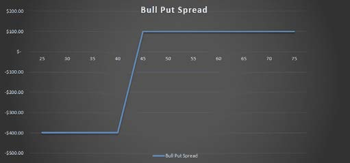

---

## 熊市认购价差 / Bear Call Spread

::: en
The Bear Call Credit Spread strategy involves selling a call option and buying another call option with a higher strike price in the same expiry month. This is a bearish option strategy. Your outlook on the underlying stock is neutral to slightly bearish. Let's look at an example:

ABC stock is trading at $47.50 in September. A trader thinks that ABC will not rise above $50 before October options expiration. He enters a Bear Call spread by selling an October $50 call for $2 and buying an October $55 call for $1. The net premium received in the trader's account is $100 ($1 × 100 shares per contract).

The maximum risk on the trade is $400 ($5 difference in strike prices, less $1 premium received times 100).

At expiry, if ABC finishes below $50, the trader keeps the $100 premium for a return of 20% on capital at risk.
:::

::: zh
熊市认购价差（Bear Call Credit Spread）的做法是：卖出一份 Call，同时在**同一到期月**内买入一份行权价**更高**的 Call。这是一种**看空**的期权策略——你对标的的预期是**中性偏空**。继续看例子：

假设 9 月份 ABC 股价为 **$47.50**。交易员认为 ABC 在 10 月期权到期前不会涨破 $50。他卖出一份 10 月到期、行权价 $50 的 Call，收取 $2；同时买入一份 10 月到期、行权价 $55 的 Call，付出 $1。账户净收到的权利金为 **$100**。

最大风险为 **$400**；到期时股价收在 $50 之下即可稳赚 $100，同样是**风险资本 20%** 的回报。
:::

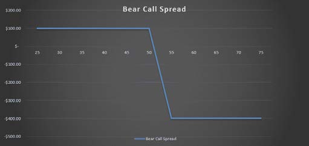

---

## 组合：完整的铁鹰 / Putting It All Together

::: en
Placing the above two trades together creates an Iron Condor. In this example, the trader is betting that ABC will stay somewhere between $45 and $50 between now and October expiration. If that occurs, the trader keeps the total $200 in premium.

One advantage of Iron Condors is that you can essentially receive **double the income** for the same amount of risk. If you place the Bull Put Spread or Bear Call Spread in isolation, the maximum risk would be $400. If you placed both at the same time to create an Iron Condor, your capital at risk is slightly less because of the 2 lots of premium you are bringing in.

Let's look at the details of an Iron Condor using the above examples:
:::

::: zh
把上述两笔交易**同时**建仓，就构成了一笔**铁鹰（Iron Condor）**。在这个例子里，交易员赌的是：到 10 月到期时，ABC 会停留在 **$45 ~ $50** 之间。如果如愿，他一共能拿到 **$200** 的权利金。

铁鹰的一大优势是：**在同等风险下，收益近乎翻倍**。单独建一笔 Bull Put 或 Bear Call，最大风险是 $400；而同时建两笔合成铁鹰，因为多收了两次权利金，**实际占用风险资本反而会略少**。

把上面两笔价差组合起来看，铁鹰的损益结构如下：
:::

::: en
Let's look at the details of an Iron Condor using the above examples:

| Item | Value |
| --- | --- |
| **Maximum Profit** | **$200** |
| **Maximum Loss** | **$300** |
| **Potential Return** | **66.67%** |

*(Max loss = strike spread $5 × 100 − premium received $200 = $300; Return = 200 / 300 ≈ 66.67%)*
:::

::: zh
把上面两笔价差组合起来看，铁鹰的损益结构如下：

| 项目 | 数值 |
| --- | --- |
| **最大收益** | **$200** |
| **最大亏损** | **$300** |
| **潜在回报率** | **66.67%** |

*(注：最大亏损 = 行权价差 $5 × 100 - 已收权利金 $200 = $300；回报率 = 200 / 300 ≈ 66.67%)*
:::

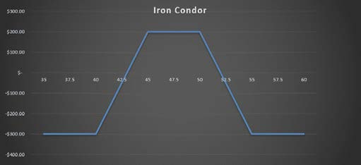

---

## 何时建仓铁鹰 / When to Enter Iron Condors

### 区间扩张之后 / After a Range Expansion

::: en
The market goes in ebbs and flows. Sometimes there is range expansion and sometimes markets are pretty flat and benign.

After one comes the other. If we experience an extended period of contraction, then soon after we will see a period of expansion. After a big period of expansion, comes a period of contraction. **That's when Condors can do well.**

In the chart below, you can see there was a massive range expansion in November 2016 coinciding with Donald Trump's surprise election win. The Bollinger Bands blew out to the widest they had been in a long time.

**What happened after that?** RUT stayed in a range between 1350 and 1450 for the best part of **eight months**!

Yes, Condor traders, myself included, suffered losses in November 2016, but what followed was one of the best periods on record for Iron Condor traders. If a new trader gave up after November just because they had a bad loss, they would have missed eight months of good times.
:::

::: zh
市场总是在**潮起潮落**——有时区间剧烈扩张，有时则窄幅震荡、波澜不惊。

一者之后必有其二。长时间的收缩之后，紧随其后的就是扩张；剧烈扩张之后，又会迎来收缩。**这正是铁鹰大显身手的时机。**

下图展示了 2016 年 11 月份发生的一次**巨大区间扩张**——背景是特朗普意外赢得大选。布林带（Bollinger Bands）当时开口到了近些年的**最大**水平。

**然后呢？** RUT 指数在随后的**整整 8 个月**里，乖乖地待在 **1350 ~ 1450** 的区间内！

是的，包括我在内的铁鹰交易员，在 2016 年 11 月那波都亏过钱；但紧随其后的，是铁鹰历史上**最黄金的时期之一**。如果一个新交易员因为 11 月的亏损就放弃了，那他将错失后面整整 8 个月的好光景。
:::

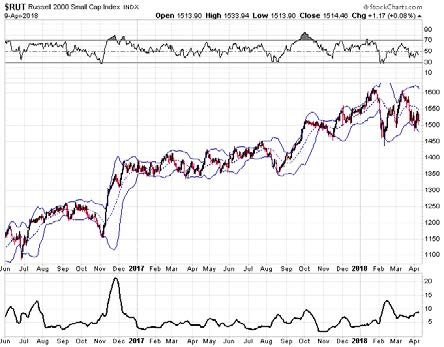

> *罗素 2000 指数（$RUT）日线图，2016 年 6 月 – 2018 年 4 月。布林带在 2016 年 11 月特朗普当选后大幅开口，随后 RSI 长时间维持在 70 以上的"超买"区间。底部波动率指标也形成尖锐的"山峰"。数据截至 2018-04-09，当日收 1514.46。*
---

### 波动率飙升时 / On a Volatility Spike

::: en
These are short **Vega** trades. We're selling vol, so we want to open trades when vol is high. **Sell high, buy low.** The caveat to that is that sometimes we've seen some pretty aggressive V-shaped reversals which is where some traders have gotten into trouble.

We get a big drop in the market and a massive vol spike and they think, "Great, vol is super high, this is a perfect time for an Iron Condor". But, sometimes that's not the case and it can even be the worst time to enter.

If markets have a big V-shaped reversal, then the call side of an Iron Condor is going to come under pressure pretty quickly. I've seen it many times in recent years.

A good idea is to **wait a week or two** after those big vol spikes, you don't necessarily want to get the absolute top in volatility.

A great place to find volatility data is [www.ivolatility.com](http://www.ivolatility.com). I use it every day and you can get most of the data you need for free, or by providing your email address.

The below chart shows the implied volatility and historical volatility for RUT.
:::

::: zh
铁鹰是 **做空 Vega** 的交易——我们在卖出波动率，所以希望 **在波动率高时建仓**。**卖高买低** 嘛。但要注意的是，市场有时会出现剧烈的 **V 形反转**——这正是很多人栽跟头的地方。

市场大跌、波动率飙升——很多人第一反应是："波动率这么高，正是做铁鹰的黄金时机！"然而现实往往打脸，有时这反而是**最不该进场**的时候。

一旦市场出现 V 形反转，铁鹰的 **认购端（Call side）** 会立刻承压。过去几年我见过太多次。

比较稳妥的做法是：**等上一两周**再行动。不必追求卖在波动率的"绝对最高点"。

一个查询波动率数据的好地方是 [www.ivolatility.com](http://www.ivolatility.com)。我每天都在用，免费版就能拿到大部分数据，邮箱注册即可。

下图展示了 RUT 指数的 **隐含波动率（IV）** 与 **历史波动率（HV）** 对比。
:::

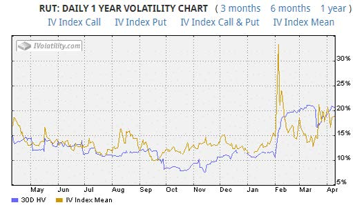

> *RUT 的 IV Index Mean（IV 指数均值，金线）与 30D HV（30 日历史波动率，蓝线）近 1 年走势对比。IV 长期高于 HV（波动率溢价），但在 2 月初恐慌时 IV 急速飙升至 30% 以上，随后回落；HV 因计算滞后反而维持高位。数据来源：IVolatility.com。*

---

### 根据 IV Rank / Based on IV Rank

::: en
Through the use of a measure called the **implied volatility rank** (IV Rank), you can determine whether the implied volatility is high or low relative to what it was in the past and even relative to other options.

The way it works is that an option's current implied volatility is compared against the historic range of implied volatilities for that option. Then a rank is assigned between 0 (minimum) and 100 (maximum).

This rank shows how low or high the current implied volatility is compared to where it has been at different times in the past.

As an example, say you had six readings for implied volatility which were 10, 14, 19, 22, 26 and 30. You've just calculated the current implied volatility and it is 10.

In this example, it would be given a rank of **0** since it is equal to the lowest value in the range.

If instead the current implied volatility was 30, it would be given a rank of **100** as it is equal to the highest value in the range.

A good free scanner for IV Rank is available from [www.marketchameleon.com](http://www.marketchameleon.com). You can access this data for free and can be a good way to find trade ideas. They also have a scanner for low IV Rank stocks.

You can find a more detailed guide on IV Rank [here](https://optionstradingiq.com).
:::

::: zh
通过一个叫做 **IV Rank（隐含波动率排名）** 的指标，你可以判断当前的隐含波动率相对于**历史水平**、甚至是**其他期权**而言，是高还是低。

工作原理是：把该期权**当前的 IV**与**过去 IV 的极值范围**做比较，然后赋一个 **0 ~ 100** 的排名（0 = 历史最低，100 = 历史最高）。

这个数字直观反映了"现在的 IV 在历史上算什么水位"。

举例：假设过去 6 次记录的 IV 分别是 10、14、19、22、26、30。你现在算出的当前 IV = 10，那它的 IV Rank 就是 **0**（因为等于历史最低）；如果当前 IV = 30，IV Rank 就是 **100**（因为等于历史最高）。

一个免费的 IV Rank 扫描器：[www.marketchameleon.com](http://www.marketchameleon.com)。免费版就能用，是挖交易思路的好工具。他们还提供**低 IV Rank** 股票的扫描器。

想更深入了解 IV Rank，可以看这份详细指南。
:::

---

### 随时建仓？ / Any Time?

::: en
There's an argument to be said that you should trade them in a consistent manner every week or every month. There will be good periods and there will be bad periods, like any trading strategy. But over the long run, the probabilities should play out.

One of the worst things you can do is **quit trading Iron Condors after a bad period**, because chances are a good period is right around the corner.

Likewise, don't get too cocky after a good period, because your next losing trade is probably not far away.

**Consistency is the key to success.**

Scaling in to trades can be a good idea. Rather than going in with 100% position size on day 1, start with **25% size** and then each week, open the next 25% until you've built the full position.

You can also do the same on the way out. Rather than exit the whole position at once, take it off in **25% increments**.
:::

::: zh
有一种观点认为：应该**每周/每月**保持**稳定节奏**地交易铁鹰。好时期和坏时期都会有——任何策略都是这样。但长期看，**概率会起作用**。

最糟糕的做法之一是：**亏了一波就退出**。好光景很可能就在下一段。

反过来，一段好光景之后也别太得意忘形——下一笔亏损很可能就在不远处。

**一致性，才是成功的关键。**

**分批建仓**是个好办法：不要在第一天就满仓下 100%，可以**先建 25%**，然后每周再加 25%，直到建完。

**平仓时也一样**——不要一次性全平，按 **25%** 阶梯式出场。
:::

---

## 长期还是短期铁鹰 / Long-term or Short-term Iron Condors

::: en
I tend to generate a lot of controversy when I share this opinion, but **I much prefer long term iron condors to short term condors**.

Part of the reason for switching to longer-term condors was out of necessity. Moving back to Melbourne where the time difference is an issue, I needed a much lower maintenance method of trading.

Long term condors move very slowly in comparison to their short-term counterparts so they have proven perfect for my timezone constraints.
:::

::: zh
每次我把这个观点说出口，都会引来不少争议——**我个人更偏好长期铁鹰，而非短期。**

一开始转向长期铁鹰是出于**实际需要**。我搬回墨尔本之后，时差成了问题，需要一种**更省维护精力**的交易方式。

长期铁鹰走得慢、对调整的及时性要求低，简直是为我的时差量身定做。
:::

---

### 慢变量 / Slow Movers

::: en
I like to share an example from **March 2018** to illustrate the point. RUT dropped 2.18% on March 20th with an associated spike in volatility. That's just about the **worst thing** that can happen to an iron condor the day after you enter it.

Let's look at 3 different condors to see how they performed:

- **Monthly Condor** with Delta of **-16**
- **Weekly Condor** with Delta of **-12**
- **90 Day Condor** with Delta of **-10**

Given that the monthly condor had the highest negative delta, you might think that one would perform the best in a falling market, but the results might surprise you.

**Here's how the trades looked after the next day:**

- **Monthly Condor**: lost **$550**

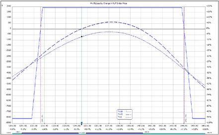

- **Weekly Condor**: lost **$2,150**

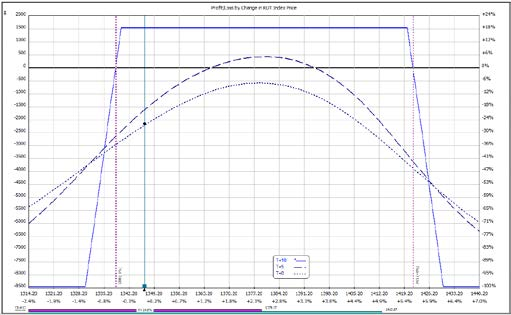

- **90 Day Condor**: actually **gained** **$100**

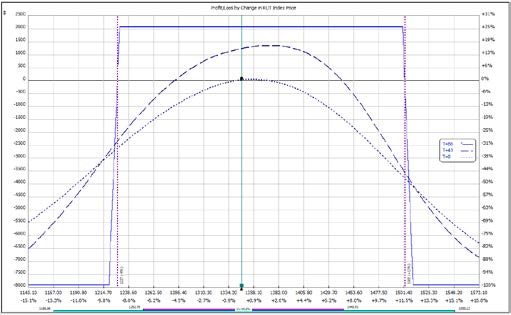

You can see the **90 day condor performed by far the best** out of the 3. Yes, the trade-off is slower time decay and lower profits in quiet markets, but I'll take that in return for **reduced P&L volatility**.

In situations like this, the weekly condor is in real trouble, the monthly condor might need to be adjusted but the 90 day condor can just be left alone to do its thing.

Everyone has their own preference and trading style, but for me, I find the **long-term condors suit my style much better** than the shorter-term condors.
:::

::: zh
拿 **2018 年 3 月** 的一个例子来说明。RUT 在 3 月 20 日**单日下跌 2.18%**，伴随波动率飙升——这几乎是**铁鹰建仓后第二天最不想看到的剧本**。

我们比较 3 种不同期限的铁鹰：

- **Monthly Condor**（月度铁鹰，Delta = -16）
- **Weekly Condor**（周度铁鹰，Delta = -12）
- **90 Day Condor**（90 日铁鹰，Delta = -10）

月度铁鹰的负 Delta 最大，你可能以为它在下跌行情里表现最好——但结果可能让你意外。

**次日盈亏对比：**

- **Monthly Condor**：亏 **$550**

- **Weekly Condor**：亏 **$2,150**

- **90 Day Condor**：反而**赚**了 **$100**

显然 **90 日铁鹰完胜**。代价是时间价值衰减慢、平静市赚得少，但我愿意用这个代价换**P&L 曲线的低波动**。

这种市况下，**周度铁鹰水深火热**，**月度铁鹰可能需要调整**，而 **90 日铁鹰**可以安心躺着不动。

萝卜青菜各有所爱，但**长期铁鹰更对我的胃口**。
:::

---

## 理解升水与贴水 / Understanding Contango and Backwardation

::: en
Any discussion about short-term and long-term Iron Condors wouldn't be complete without a discussion on **Contango and Backwardation**. Fun stuff this is!

So, funny names, but important concepts.

**Contango** and **Backwardation** refer to the shape of the **volatility term structure**. You can find the full details at the [VIX Term Structure Guide](https://optionstradingiq.com/everything-you-need-to-know-about-vix-term-structure/), but the general idea is that the level of implied volatility is different for each different option expiration period.

The normal situation is that volatility is lower in the front months and the back months are higher. This makes sense if you think about it, because the further out in time you go, the more chance that a volatility event can occur, so traders want to be compensated for that risk. This situation is called **Contango** and occurs most of the time in the market, particularly during bull markets.

The opposite occurs when the market experiences a volatility event. The volatility in the front months skyrockets while the back months don't rise as much. This is because the market knows that **panics usually die down within a few weeks** and things return to normal.

VIX Term Structure is important because it tells us a lot about the current state of the market.

- When the Term Structure is in **Contango**, markets are in a calm state and are behaving normally.
- When we shift to **Backwardation**, markets are in **panic mode**.

Sometimes panics can reverse quickly such as during Brexit, but other times the market can remain in Backwardation for an extended period such as during the financial crisis of 2008.

Yes, taking a contrarian view can be profitable when markets panic, but we also need to be aware that **some of the worst market declines in history have come AFTER the VIX Futures market moved into Backwardation**.
:::

::: zh
聊完短/长期铁鹰，就不得不提 **Contango（升水）** 与 **Backwardation（贴水）** 这两个概念。名字古怪，但很重要。

名字搞笑，意义重大。

Contango 与 Backwardation 描述的是 **波动率期限结构（Volatility Term Structure）** 的形状。完整内容可见 [VIX 期限结构指南](https://optionstradingiq.com/everything-you-need-to-know-about-vix-term-structure/)。简单说：不同到期月的期权，IV 高低各不相同。

正常情况下，**近月 IV 低、远月 IV 高**。这也合理——时间越长，发生波动事件的概率越大，卖家要的风险补偿也越多。这种形态叫 **Contango（升水）**，是市场常态，尤其在牛市更明显。

出现波动率事件时则相反：**近月 IV 暴涨，远月 IV 涨得不多**。因为市场知道**恐慌通常几周内就会平息**，一切照旧。

VIX 期限结构之所以重要，是因为它能告诉我们**市场现在处于什么状态**。

- Contango = 市场平静、运行正常。
- Backwardation = 市场进入恐慌模式。

有时恐慌很快反转（脱欧就是），但有时（比如 2008 金融危机）会持续相当长时间。

逆向操作确实可能在恐慌中获利，但也要警惕——**历史上一些最惨烈的下跌，正是发生在 VIX 期货进入 Backwardation 之后**。
:::

---

### 波动率末日 / The "Volpocalypse"

::: en
Here's an example from **February 2018** when VIX spiked an almighty **115.6%** from 17.31 to 37.32. The previous biggest spike (excluding the 1987 crash because VIX didn't exist then) was **64.20%** in February 2007. **Just let that sink in for a minute.**

The spike was nearly twice as big as the previous biggest spike. It literally wiped out traders by the thousands and even saw the **collapse of a few volatility ETFs**.

Below, you can see what happened to the VIX Term Structure on that day.

You can see that the market went from Contango to Backwardation and the impact of the volatility spike was greatest in the front month options. The back months weren't impacted much at all.

**Now you might realize why I prefer long-term Iron Condors!**
:::

::: zh
来看 **2018 年 2 月** 的例子：VIX 单日**暴涨 115.6%**，从 17.31 飙到 37.32。在此之前（不计 1987 崩盘，因为那时 VIX 还没出生），最大单日涨幅是 2007 年 2 月的 **64.20%**。**感受一下这个数字。**

那次涨幅几乎是历史最大涨幅的**两倍**。数以千计的交易员爆仓，连几只**波动率 ETF 都直接清零**。

下图展示了**当天**VIX 期限结构的变化。

可见，市场从 Contango 翻转成 Backwardation，且**波动率的冲击主要集中在近月合约**，远月合约影响很小。

**现在你应该明白我为什么偏爱长期铁鹰了！**
:::

---

## 分腿建仓 / Legging In to an Iron Condor

::: en
When I'm entering an iron condor trade, I like to wait until one of the verticals gets filled and then quickly make sure the other one gets filled.

Legging in is the process of selling one of the verticals and waiting for the stock to move (hopefully in your direction) before entering the other vertical.

Legging in to an iron condor offers the potential for higher returns, but it also comes with **higher risk**.
:::

::: zh
我建铁鹰的习惯是：先等**一侧价差**成交，然后**迅速**让另一侧也成交。

"分腿建仓"（Legging In）就是：先建一侧价差，等股价（最好向你期望的方向）移动后再建另一侧。

分腿建仓可能提高收益，但**风险也更高**。
:::

---

### 分腿建仓的风险 / Risks of Legging In to Iron Condors

::: en
There are risks with any trading strategy and the same goes for legging in to iron condors.

If a trader is bullish they might start by selling a bull put spread. Then, if the market declines, that spread is placed under pressure with **no offsetting gains** from the declining price of the bear call spread.

However, the opposite is also true. If the market rallies, the trader makes all the gains from the declining put spread with **no offsetting loss** on the call spread.
:::

::: zh
任何策略都有风险，分腿建仓也不例外。

如果你看多，先建了 Bull Put Spread。一旦市场下跌，这侧价差承压，而另一侧（Bear Call）却**没有任何对冲收益**。

反过来也一样：市场上涨时，Put Spread 一边吃满收益，**Call Spread 一边却没有任何对冲损失**——听起来很爽，但承担的是"单边裸奔"的风险。
:::

---

## 选择行权价 / Selecting Iron Condor Strikes

::: en
There are a number of different factors you could take into consideration when choosing strikes on your iron condor trades. Some people tend to over-analyze and then are overcome with **analysis paralysis**. Others try to take a rules-based approach and take the emotions out of the decision making process.

For those suffering from the dreaded analysis paralysis, let's see if we can come up with some pretty standard rules for iron condor entry.

There are **3 main ways** to choose the short strikes:

1. **Use delta. i.e. Sell 10 delta or 15 delta**
2. **Use standard deviation. i.e. sell strikes 1 or 2 standard deviations away from the current price**
3. **Use technical analysis**

Using a combination of all three makes sense, but you also don't want to overcomplicate things. Some traders will just sell 15 delta iron condors no matter what. There is nothing wrong with that.

Personally, I use delta as the main criteria and tend to place the short strike around a **10-15 delta**.
:::

::: zh
选择铁鹰行权价时，需要考虑的因素很多。有人过度分析，最后陷入"**分析瘫痪**（analysis paralysis）"；也有人走**规则化**路线，把情绪剔除出决策。

给"分析瘫痪症"患者开个药方——以下是几个**标准化的建仓规则**。

短腿行权价的选择，主要有 **3 种思路**：

1. 用 Delta 选：卖出 10 Delta 或 15 Delta 的期权。
2. 用标准差选：卖出现价 ±1~2 个标准差之外的行权价。
3. 用技术分析选：参考支撑位、阻力位、趋势线等。

三者结合是合理的，但别把事情搞复杂。有些交易员**不管什么情况都只卖 15 Delta 的铁鹰**，也没毛病。

我个人**以 Delta 为主要标准**，短腿行权价通常放在 **10~15 Delta**。
:::

---

## Delta Dollars：最重要的指标 / Delta Dollars May Be the Single Most Important Metric to Learn

::: en
Delta is one of the four main option greeks, and any serious trader needs to have a thorough understanding of this greek if they hope to have any chance of success in trading options.

**Delta dollars** is quite simply the **position delta × the underlying price**.

We know that delta gives us the share equivalency ratio, so if we own a long call with delta 0.40 it is equivalent to being long 40 shares of the underlying.

Let's assume the stock is trading at $100. The delta dollars figure would be **40 × $100 = $4,000**.

This tells us that the option position is equivalent to having **$4,000 invested in the stock**.

The delta dollars figure is going to depend a lot on the price of the stock. Let's say that instead of the stock trading at $100, it was trading at $500. Our delta dollars figure in this example would be **40 × $500 = $20,000**.

Perhaps now you can understand why it's important to look at the **delta dollars number** and **not just the delta**.
:::

::: zh
Delta 是期权四大希腊字母之一。严肃的交易员必须**彻底吃透**它，否则在期权市场里几乎没机会成功。

**Delta Dollars** 的定义非常简单：**持仓 Delta × 标的当前价格**。

我们知道 Delta 反映的是"**股票等价头寸**"。比如持有一份 Delta = 0.40 的 Long Call，相当于持有 40 股正股。

假设股价 $100，则 Delta Dollars = 40 × $100 = **$4,000**。

这意味着这份期权头寸，等价于**在股票上投入了 $4,000**。

Delta Dollars 严重依赖股价。如果股价是 $500，那 Delta Dollars = 40 × $500 = **$20,000**。

现在你应该明白，**看 Delta Dollars 数字比单纯看 Delta 重要得多**。
:::

---

### 为什么重要 / Why Is It Important

::: en
Delta dollars tells us our **overall directional exposure in the market**.

If our account size is $50,000 and our delta is 100, that doesn't really tell us much. But if our **delta dollars exposure is $200,000**, then we know that **it is too high for our account size**.

Personally, I like to set a rule that I don't let my delta dollar exposure get above **150% of my account size**. More conservative traders might like to set that rule at 100%, whereas more aggressive traders might set it at 200%.

It's personal preference, but the first step as a delta neutral trader is to start paying attention to delta dollars and then develop rules around this metric.

I also have rules regarding the delta dollar exposure **for each trade and strategy**.
:::

::: zh
Delta Dollars 反映的是**整体的方向性敞口（用美元计）**。

假设账户 $50,000、Delta = 100，这数字本身看不出什么名堂。但如果**Delta Dollars 敞口高达 $200,000**，对账户来说就**太激进了**。

我给自己定的规则是：**Delta Dollars 不超过账户净值的 150%**。保守的人可以卡 100%，激进一点的可以放到 200%。

具体数字因人而异，但**第一步**是先**关注**这个指标，再围绕它**立规矩**。

我对**每一笔交易、每一个策略**都会单独设定 Delta Dollars 限额。
:::

---

### 实战案例 / Practical Example

::: en
For an iron condor, I usually set a **200% rule** for Delta Dollars.

Assume you have an iron condor on RUT that is risking $20,000. If the Delta Dollars figure gets above plus or minus **$40,000** you might want to think about **adjusting and getting back closer to neutral**.

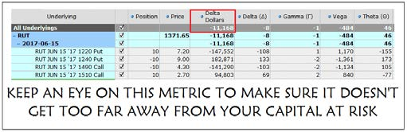
:::

::: zh
铁鹰策略上，我通常把 Delta Dollars 卡在 **200%** 警戒线。

假设 RUT 上的一笔铁鹰占用风险 $20,000。一旦 Delta Dollars 偏离中性超过 **±$40,000**，就该考虑**调整仓位、回到中性**。

:::

---

## Delta 对冲 / Delta Hedging

::: en
Sometimes markets move really quickly and it leaves us little time to adjust our positions.

Here's a quick and easy strategy I use to **cut my exposure and stem the bleeding** while I figure out whether I want to adjust or close the main position.

Let's say we have the following Iron Condor that is showing too much **positive Delta** as the market is **falling**.

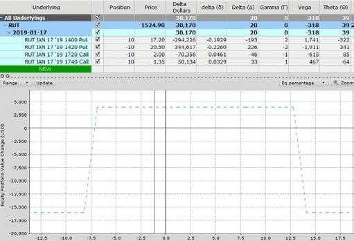

Assuming we decide we don't want to adjust the Condor, and we want to give it a bit more time to see if the market will bounce. But, we are concerned that further downside will see our losses start to pile up pretty quickly.

In that case, we can simply **buy 1 put option** to neutralize the Delta.

You can see above that the net position Delta is **20**. So we simply **buy a 20 Delta put** and voila, we're back to **Delta neutral**.

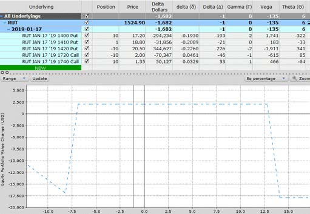

If the market continues to fall, the long put acts as a hedge and will **reduce the losses** on the Condor.

If the market rallies, we can sell the long put for a small loss, it's done its job and is no longer needed.

Delta hedging can get a lot more advanced than this, but this gives you a quick insight into how the process works.
:::

::: zh
有时市场瞬息万变，根本没时间从容调整。

我用一种"又快又简单"的办法——**先降低敞口、止血**，再从容决定是调整还是平掉主仓。

假设下面这笔铁鹰，随着**市场下跌**，**正 Delta** 变得过大（即"方向性偏空"被放大）：

假设我们决定**暂不调整**铁鹰，再给市场一点时间看会不会反弹，但担心**继续下跌会让亏损快速放大**。

这时，**直接买入 1 份 Put** 就能把 Delta 拉回中性。

上图显示净头寸 Delta = **20**。所以**买一份 20 Delta 的 Put**，"啪"的一下，就**回到 Delta 中性**了。

如果市场继续跌，**这手 Long Put 充当对冲**、**减少**铁鹰的亏损；如果市场反弹，可以小亏卖出这份 Put——**任务完成，可以收工**。

Delta 对冲可以做得远比这复杂，这里只是给你一个**入门视角**。
:::

---

## 指数期权还是 ETF 期权？ / Should You Trade Index or ETF Options?

::: en
Trading options on the main US indices is growing in popularity every year. But what are the best ways to do this? There are two very similar assets to choose from — **SPY** which is an Exchange Traded Fund and **SPX** which is an Index. Both are very popular with great liquidity, but what's the difference?

Let's take a look at some of the factors when considering "Should I trade index options or ETF options?"

#### Liquidity

Liquidity is a huge consideration when trading Iron Condors. Slippage can really eat into your profits and it takes some practice and experience in order to get good fills.

Also, opening a trade is one thing. When markets tank, the bid-ask spread widens significantly and you can get killed trying to get out of a position quickly.

Traders who are worried about liquidity, or are just starting out, should stick to the **ETFs** as there will be less slippage.

When comparing liquidity on the major indexes, there is not much difference between index options and ETF options as both are very, very liquid.

#### Settlement

Trading Index options occasionally provides a risk due to the settlement process. The way it works is this.

The monthly options **cease trading on Thursday at 4pm**, BUT the **final settlement price is calculated based on the prices that each stock in the index opens at on Friday**.

So, if there is a big gap up or down on the Friday morning the final settlement value could be significantly different to what you would expect based on Thursday's close.

This can cause a problem if you are holding an Iron Condor that is close to the money; a big gap up or down could mean that your sold option **finishes in-the-money on settlement** even though you were nice and safe when the market closed on the Thursday.

The only way to **100% eliminate this risk** is to **close out the options on the Thursday before the close**.

I would usually do this if the index was within **1-2%** of my strike prices just to be on the safe side.

#### Commissions

There are a lot of brokers offering commission free trading these days so commissions are less of a factor than they used to be. However, there are still option contract fees to consider, so larger traders might prefer to trade **SPX** rather than **SPY** so they trade **less contracts**.

#### Tax

Indexes have **preferential tax treatment** and as such may be more suitable for larger traders. Income from index options is treated as **60% long term and 40% short term**, regardless of the trade duration.

Income from ETF options is treated the same as stock. As Iron Condors are short term trades of between 15 and 60 days, index options will be more advantageous from a tax perspective.

#### Capital Level

The **SPY** ETF is approximately **1/10 the value** of the **SPX** Index.

Those with a smaller capital balance may be better off trading **SPY**, as trading SPX may mean their capital at risk is too high.

#### Dividends

While not a huge consideration, **ETFs pay dividends** while indexes do not. When an ETF goes ex-dividend, the price usually drops by the amount of the dividend.

This is something that you may need to take into consideration when selecting your strikes. ETF traders would also need to keep an eye on this close to expiration due to **early assignment risk** as discussed shortly.

#### Early Assignment

Early Assignment is only an issue for **American style options**.

Stocks and ETFs are American style, while indexes are **European style**.

If you are trading Iron Condors and credit spreads on the indexes (**RUT, SPX, NDX and MNX**), you don't even need to worry about it.

For those who trade the ETFs (**IWM, SPY and QQQ**), there is a risk of early assignment but the risk is **incredibly low and almost not worth worrying about**.

The main reason to exercise an option early is to **receive the dividend**, and the option would have to be **deep in-the-money** to do that.

If you are trading American style options, the most important thing is to **not let your short options go in-the-money** and keep an eye on **dividend dates**.
:::

::: zh
美国主要指数的期权交易一年比一年火。标的方面有两类高度相似的选择——**SPY（ETF）** 和 **SPX（指数）**。两者都流动性极佳，但区别在哪？

下面从几个维度对比"**该选指数期权还是 ETF 期权？**"。

#### 流动性

**流动性**是做铁鹰时要重点考虑的。**滑点（slippage）**会吃掉不少利润，需要经验和盘感才能拿到好价位。

进场是一回事，**逃命**是另一回事。市场跳水时，买卖价差会**大幅拉开**，想快速平仓可能被"**屠杀**"。

担心流动性、或是刚入门，**老老实实选 ETF**——滑点更小。

不过在主流指数上，**指数期权和 ETF 期权的流动性都极好**，差异不大。

#### 结算

指数期权**结算**偶尔会埋雷。规则是这样的：月度期权**在周四下午 4 点停止交易**，但**最终结算价**是按**周五开盘时**成分股的报价计算的。

也就是说，**周五开盘一旦大幅跳空**，最终结算价可能**和周四收盘时的预期差出一大截**。

如果你持有的铁鹰**接近平值**（ATM 附近），这种跳空可能导致**你卖出的期权在结算时变成实值（ITM）**——而周四收盘时你明明还安全。

想**100% 消除**这个风险？**周四收盘前平掉**是唯一办法。

只要指数距离我的行权价在 **1~2%** 以内，我通常就会这么做——**求稳**。

#### 佣金

现在很多券商都免佣金了，影响小了不少。但合约费还是有的——**大资金**交易者更愿意选 **SPX**（合约数更少、合约费更省）。

#### 税务

指数期权享受**税收优惠**——收入按 **60% 长期 + 40% 短期**处理，**与持仓时间长短无关**。

ETF 期权的收入按**普通股票**处理。铁鹰通常持仓 15~60 天，从税务角度，**指数期权更有优势**。

#### 资金规模

**SPY 的价格大约是 SPX 的 1/10**。小资金账户**优先选 SPY**，因为 SPX 一手占用的风险资本对你来说可能太大了。

#### 分红

影响不大，但**ETF 有分红、指数没有**。ETF 除息日股价通常会**下跌分红金额**。

选行权价时要把这点考虑进去。ETF 交易员临近到期时还要警惕**提前行权风险**（见后文）。

#### 提前行权

提前行权只针对**美式期权**。**股票和 ETF 是美式，指数是欧式。**

如果你在 **RUT、SPX、NDX、MNX** 这些指数上做铁鹰/信用价差，**完全不用担心**。

交易 **IWM、SPY、QQQ** 等 ETF 期权的，理论上存在提前行权风险，但**概率极低，几乎可以忽略**。

提前行权的主要动机是**抢分红**，但只有在期权**深度实值（Deep ITM）**时才值得这么做。

交易美式期权时，最重要的两件事：**别让你的 Short 腿变成 ITM**，并**紧盯除息日**。
:::

---

## 小资金如何做铁鹰 / How to Trade Iron Condors with a Small Account

::: en
Beginner traders sometimes shy away from options trading and iron condors in particular because they are worried they can't do it effectively with a small account.

Ideally, you want to have around **$5,000 to $10,000** at a minimum to start trading options.

You can even start trading with as little as **$2,000**. In fact, in some respects, it's better to start with a small account while you are learning. That way, if a trade goes bad you haven't done too much damage to your net worth.

Even if you have **$200,000** available for trading options, just start with **$10,000** and get a feel for how things work. Then, when you've been trading for a year or so, **SLOWLY** build your account from there.

You don't want to jump from $10,000 to $200,000 overnight.

The psychological aspect of trading a $200k account is much different to a $10k account.

Iron Condors are **risk defined trades**. The required capital for a trade is equal to the **maximum loss**. Unless the market makes a catastrophic move, you are unlikely to suffer a max loss on a trade. The only time that would happen is if a trader is **too stubborn to stick to a stop loss**.

Over the long-term, trading an options-based portfolio with a small account requires traders to stick to **pretty well defined rules and trading plans**. **No flying by the seat of your pants please!**

Below are some of the key concepts to consider when trading iron condors with a small account:

1. **Set the probability of success in your favour to ensure a statistical edge**
2. **Only open Condors on underlying assets with a high IV Rank**
3. **Stick to the most liquid instruments (SPY, AAPL etc)**
4. **Be consistent in your process**
5. **Use appropriate position size to manage risk exposure**
6. **Use ETFs instead of individual stocks to mitigate earnings risk**
7. **Keep an adequate cash buffer for adjustments (30-40%)**
8. **Avoid weekly options**
9. **Have a strict stop loss. Don't let losses blow out!**
:::

::: zh
不少新手交易员因为"**钱少做不好**"而对期权、特别是铁鹰敬而远之。

理想情况下，**起步资金至少 $5,000 ~ $10,000**。

实际上 **$2,000** 就能开始。甚至某种程度上，小资金起步**更好**——亏了也不会伤筋动骨。

哪怕你手头有 **$20 万**，**先用 $1 万** 起步、积累感觉。**交易满一年后，再慢慢加码**。

不要**一夜之间**从 $1 万跳到 $20 万。

**$20 万账户** 和 **$1 万账户** 承受的心理压力完全是两码事。

铁鹰是**风险有限**的策略。占用资金 = 最大亏损。除非市场出现**灾难性**行情，否则不太可能吃满最大亏损——但前提是你**别死扛不止损**。

长期看，小资金做期权组合必须**严格按规则和交易计划执行**。**别凭感觉瞎搞！**

小资金做铁鹰的关键要点：

1. 设定对你有利的胜率，确保有**统计优势**。
2. 只在 **IV Rank 高**的标的上建仓。
3. 只挑**流动性最好**的标的（SPY、AAPL 等）。
4. 流程要**保持一致**。
5. 仓位**大小合适**地控制风险敞口。
6. 优先 **ETF** 而非个股，避开**财报风险**。
7. 留出 **30-40%** 的**现金缓冲**用于调整。
8. **远离周度期权**。
9. 设定**严格的止损**，**别让亏损失控**！
:::

---

## 如何在闪崩中存活 / How to Survive a Flash Crash

::: en
One of the first things people ask when they learn about Iron Condors (and I had the same question when I first learned about them), is "**what happens during a market crash?**"

At the end of the day, all trading is risky, no matter the strategy.

Finance 101 tells us that **the higher the return we are aiming for, the more risk we must be taking**. If you're aiming for 5% returns per month, that equates to 60% per year. That's better than Warren Buffett and most hedge fund managers.

So, the first step is to have **realistic expectations of returns** and not take on too much.

Other ways to manage the risk of a Flash Crash are:

1. **Use stop losses**
2. **Buy VIX call options**
3. **Buy further out-of-the-money puts**
4. **Delta Hedge**

You can read about these concepts in more detail [here](https://optionstradingiq.com).
:::

::: zh
大家刚接触铁鹰时最爱问（我也曾问过）的问题——**"市场崩盘时怎么办？"**

归根到底，**所有交易都有风险**，没有例外。

**金融常识**：**预期收益越高，承担的风险就越大**。每月 5%，年化就是 60%——这比巴菲特和大多数对冲基金经理都强。

所以，第一步是**对收益有合理预期**，别贪。

管理闪崩风险的其他方法：

1. 设定**止损单**。
2. 买入 **VIX Call**（押注波动率飙升）。
3. 买入**更虚值**的 Put（深度对冲）。
4. 做 **Delta 对冲**。

这些方法的详细介绍见[原文链接](https://optionstradingiq.com)。
:::

---

## 理解 Gamma 风险 / Understanding Gamma Risk

::: en
Gamma is the ugly stepchild of option greeks. You know, the one that gets left in the corner and no one pays any attention to it? The problem is, that stepchild is going to cause you some real headaches unless you give it the attention it deserves and take the time to understand it.

Gamma is the **driving force behind changes in an option's delta**. It represents the **rate of change** of an option's delta. An option with a gamma of **+0.05** will see its delta **increase by 0.05 for every 1 point move** in the underlying. Likewise, an option with a gamma of **-0.05** will see its delta **decrease by 0.05 for every 1 point move** in the underlying.
:::

::: zh
Gamma 是期权希腊字母里的"**丑小鸭**"——角落里没人疼没人爱。但问题在于，**你不理它，它就给你好看**。

Gamma 是 **Delta 变化的驱动力**——也就是 Delta 的"**变化率**"。Gamma = +0.05 的期权，**标的每变动 1 点，Delta 增加 0.05**；反之亦然。
:::

---

### Gamma 的关键点 / Key Points Regarding Gamma

::: en
- **Gamma will be higher for shorter-dated options.** For this reason, the last week of an option's life is referred to as "**gamma week**". Most professional traders do not want to be **short gamma** during the last week of an option's life.

- **Gamma is at its highest with at-the-money options.**

- **Net sellers of options will be short gamma** and **net buyers of options will be long gamma**. This makes sense because most sellers of options do not want the stock to move far, while buyers of options benefit from large movements.

- **A larger gamma (positive or negative) leads to a larger change in delta** when your stock moves.

- **Low gamma positions display a flatter risk graph**, reflecting less fluctuation in P&L.
- **High-gamma positions display a steeper risk graph**, reflecting high fluctuation in P&L.

Personally I prefer a **flatter risk graph** and therefore prefer **low gamma positions**. With Iron Condors, this means trading **longer-dated positions** as discussed earlier.

You can read more about Gamma risk [here](https://optionstradingiq.com).
:::

::: zh
- **Gamma 随到期日临近而放大**。因此期权生命周期的**最后一周**被戏称为"**Gamma 周**"。大多数专业交易员**最后一周坚决不做 Short Gamma**。

- **平值期权（ATM）的 Gamma 最大。**

- **期权净卖家 = Short Gamma，期权净买家 = Long Gamma**。很合理——卖家不希望股价乱动，买家则乐见大波动。

- **Gamma 绝对值越大，Delta 对股价变化的反应越剧烈。**

- **Gamma 越低，损益曲线越平**（P&L 波动小）；**Gamma 越高，损益曲线越陡**（P&L 波动剧烈）。

我个人偏爱**平坦的损益图**，所以偏好**低 Gamma 仓位**。对应到铁鹰，就是**做长期限**的仓位。

想深入了解 Gamma 风险，可以看[原文链接](https://optionstradingiq.com)。
:::

---

## 调整铁鹰 / Adjusting Iron Condors

::: en
Trading Iron Condors is not always beer and skittles. Sometimes, the underlying stock or index will make a big move in either direction and you will need to **adjust the position**.

The decisions of when and how to adjust should **all be part of your trading plan** and you should know in advance what you are going to do should a big move occur. What you don't want to do, is **close your eyes, cross your fingers and hope that the position comes back into profit**. **Hope is not a strategy.**

With an Iron Condor trade, the **maximum loss is more than the maximum gain**, so it is **VERY important** that you don't let small losses turn into very big losses.

Below are **nine different ways** you can adjust an iron condor; these are discussed in much more detail [here](https://optionstradingiq.com).
:::

::: zh
铁鹰交易**不是天天 beer and skittles（吃喝玩乐）**。有时标的大涨大跌，**必须调整仓位**。

**何时调整、如何调整**——**必须写进交易计划**。不要**闭眼祈祷**"仓位会回来的"。**希望不是策略。**

铁鹰策略下，**最大亏损 > 最大收益**，所以**千万别让小亏变大亏**。

调整铁鹰的 **9 种方法**，详见[原文链接](https://optionstradingiq.com)。
:::

---

## 铁鹰能做到 10% 月收益吗？ / Are 10% Returns Possible with Iron Condors?

::: en
There are a lot of websites out there promising **10% returns per month**, so can it be done?

Technically yes, you could potentially make 10% per month returns. The problem is you would have to trade **100% of your account** to do so.

If you do that, it's only a matter of time before you **blow up your account**.

The way I explain it to people is this — "if you're trying to make 10% per month, that's 120% per year. Finance 101 tells us that higher returns equals higher risk, so you must be taking on a boat load of risk in order to make 120% per year."

Think about this also, most hedge fund managers don't achieve more than 25% per year, so what makes you think you're going to do better than guys that went to Harvard, with 20+ years industry experience??

**You have to be realistic.**
:::

::: zh
市面上很多网站打着**"月收益 10%"** 的旗号，铁鹰真的能做到吗？

**技术上可以**。但代价是——你得**满仓 100%** 地干。

真要这么干，**爆仓只是时间问题**。

我给人打的比方是：**"月 10% = 年 120%**。金融常识告诉你，**高收益 = 高风险**——你为了拿 120% 的年化，**一定**在扛巨大的风险。"

再想想，**大多数对冲基金经理的年化也不超过 25%**。凭什么你觉得你能比**哈佛毕业、20 多年经验**的人更强？

**必须现实一点。**
:::

---

### 铁鹰的合理仓位 / Appropriate Allocations to Iron Condors

::: en
By now it should be pretty clear that you should **never risk 100% of your account on iron condors**. Personally, I think **about a 20% allocation is good**.

Allocation levels depend on risk tolerance so some people may prefer to go higher. Another thing to consider is to **adjust allocation levels depending on the current level of volatility**.

- **When volatility is high**, it makes sense to have a **higher allocation** to iron condors.
- **When volatility is low**, it makes sense to **reduce exposure**.

The most important thing with condors and any trading strategy to be honest, is to **have a plan and stick to it!**
:::

::: zh
看到这里，**绝不该 100% 满仓做铁鹰**这点应该很清晰了。我个人觉得 **20% 左右的仓位**比较合适。

仓位比例因人而异，但还有一条原则：**根据当前波动率水平调整仓位**。

- **波动率高** → **加仓**铁鹰
- **波动率低** → **降仓**

坦白说，铁鹰、乃至所有交易策略里，**最重要的事是：定好计划，然后照着做！**
:::

---

## 铁鹰实战案例 / Iron Condor Examples

::: en
Let's put theory into practice and look at a couple of Iron Condor examples.
:::

::: zh
理论聊完了，看两个**实战案例**。
:::

### 案例 1：RUT 长期铁鹰（2018-01-30 建仓） / Case 1: RUT Long-term Condor (Opened 2018-01-30)

::: en
The first one was opened on **January 30th, 2018** and was a **long-term Condor trading the June expiry**.

Here is the initial trade setup:

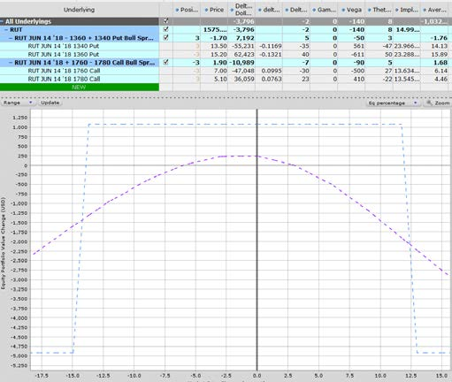

Within a few days, RUT had dropped from 1575 to 1508 and the trade was becoming skewed with **too much positive delta**.

The delta of the short put had also hit **20** which was my adjustment point.

I decided to **roll the entire position down** so the puts went from 1360-1340 to 1330-1310 and the calls came down from 1760-1780 to 1700-1720.

**Before Adjustment**

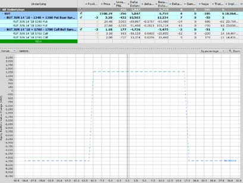

**After Adjustment**

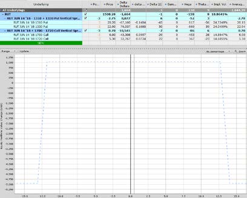

On **February 14th**, I **double the size of the trade** from 3 to 6.

**Before Adjustment** (before Feb 14 doubling)

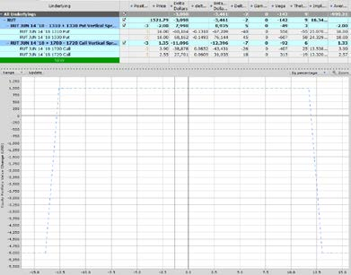

**After Adjustment**

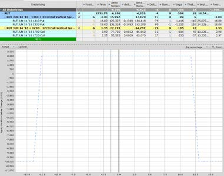

No further adjustments were needed for the trade and on **April 18th** I was able to close it out for a **$1,075 gain**.
:::

::: zh
第一个是 **2018 年 1 月 30 日** 建仓的**长期铁鹰**，到期月是 **6 月**。

> **标的**：RUT（罗素 2000 指数）· **到期日**：2018-06-14 · **建仓日期**：2018-01-30（RUT 价格约 1575）
> **头寸**：3 份（手）
> **下行腿（Put 端）**：卖 3 手 1360 Put（@15.20），买 3 手 1340 Put（@13.50）
> **上行腿（Call 端）**：卖 3 手 1760 Call（@7.00），买 3 手 1780 Call（@5.10）
> **最大收益**：3.60 × 100 × 3 = **$1,080**
> **最大亏损**：16.40 × 100 × 3 = **$4,920**
> **Theta / Vega**：做空波动率（Vega 负）、赚时间价值（Theta 正）

几天之内，RUT 从 1575 跌到 1508，仓位 **正 Delta 过大**（方向性偏多）。Short Put 的 Delta 也到了 **20** ——这就是我的 **调整触发线**。

我决定 **整体往下 Roll（移仓）** ——Put 端从 1360/1340 移到 1330/1310，Call 端从 1760/1780 移到 1700/1720。

**调整前**

> RUT 铁鹰**第一次调整前**的损益图：RUT 已跌到 1508 附近，Call 端远离价位造成收益曲线被压扁。

**调整后**

> RUT 铁鹰**第一次调整后**的损益图：整体下移后，Put 端保护位 1330、Call 端保护位 1700，回到相对中性的位置。

**2 月 14 日**，我把仓位**从 3 手加到 6 手**（即翻倍）。

**调整前**（2 月 14 日加仓前）

> 2 月 14 日加仓前 6 手规模的头寸截图：此时 P&L 已经有正向贡献。

**调整后**

> 加仓到 6 手后的损益图：最大收益约 $2,010（(2.00+1.35)×100×6），最大亏损约 -$10,000。

之后**再没调整过**。**4 月 18 日** 平仓，**净赚 $1,075**。
:::

---

### 案例 2：NFLX 铁鹰（2018-07-18 建仓） / Case 2: NFLX Iron Condor (Opened 2018-07-18)

::: en
The second Iron Condor example is a trade on **NFLX** from **July 18th 2018** when the stock was trading at **$376**.

Here is the initial setup:

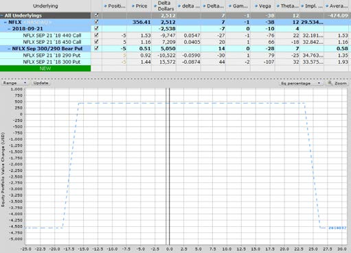

A week later, NFLX had dropped to **$356** and the short calls had dropped to a **delta of 2** and the spread was only worth **$0.14** so wasn't adding much value to the trade.

As such, I **rolled them down** from 470-480 to 440-450. The benefits of this were twofold:

1. Rolling down generated **extra premium**
2. The adjustment also brought the trade back to **delta neutral**.

**Before Adjustment**

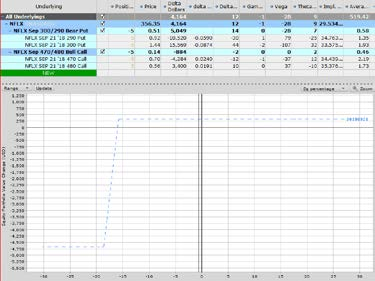

**After Adjustment**

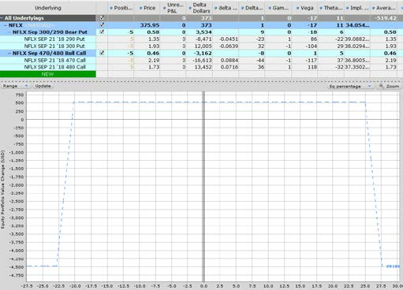

By **August 8th**, the trade had made **nearly 50% of the potential profit** in a short space of time, so I closed the position for a gain of **$295**.

These two examples are fairly straightforward and were both **winning trades**. Just because they were both winning trades, don't think that I'm claiming to **never have losing trades**.

I have a hard stop loss of **$1,000 per Iron Condor trade**, and that was hit on **two of my trades recently** during the **Coronavirus crash**.

Losses happen, it's a part of the business and you should **stay well clear of any trader claiming they never have losing trades**.

The key with Iron Condors is **not letting the losses get out of control**. Those two trades that I got stopped out on would have gone on to have **horrendous losses** if I had held on and tried to salvage the trades.

If you're in a situation like that, just **take the loss, lick your wounds and live to fight another day**.
:::

::: zh
第二个案例是 **NFLX（奈飞）**，**2018 年 7 月 18 日** 建仓，当天股价 **$376**。

> **标的**：NFLX（奈飞）· **到期日**：2018-09-21 · **建仓日期**：2018-07-18（股价约 $376）
> **头寸**：5 份
> **下行腿（Put 端）**：卖 5 手 300 Put（@1.44），买 5 手 290 Put（@0.92）
> **上行腿（Call 端）**：卖 5 手 470 Call（@2.19），买 5 手 480 Call（@1.73）
> **最大收益**：((1.44-0.92)+(2.19-1.73))×100×5 = **$490**
> **最大亏损**：(10-0.98)×100×5 = **$4,510**

一周后，NFLX 跌到 **$356**。Short Call 的 Delta 跌到 **2**，价差时间价值只剩 **$0.14**——对仓位几乎没贡献。

于是我**把 Call 端下移**：从 470/480 移到 440/450。这样做的好处有两个：

1. **下移多吃一笔权利金**
2. 顺势把仓位**拉回 Delta 中性**

**调整前**

> NFLX 铁鹰**调整前**的损益图：NFLX 从 $376 跌到 $356，Call 端因深度虚值几乎失效。

**调整后**

> NFLX 铁鹰**调整后**的损益图：Call 端下移到 440/450，仓位回到 Delta 中性。
>
> **新 Call 端**：卖 5 手 440 Call（@1.53），买 5 手 450 Call（@1.16）
> **新最大收益**：((1.44-0.92)+(1.53-1.16))×100×5 = **$445**
> **新最大亏损**：(10-0.89)×100×5 = **$4,555**

到 **8 月 8 日**，短短几周内已经**吃到了潜在最大收益的近 50%**，于是**平仓落袋为安，净赚 $295**。

这两个案例相对简单，**都赚钱**。但别因为这两个赚钱的案例，就以为我**从不亏钱**。

我对**每笔铁鹰有 $1,000 的硬止损**。最近的新冠崩盘中，**有两笔交易被打到止损线**。

**亏损是这行的一部分**。任何声称"从不亏钱"的交易员，**离他远点**。

铁鹰的关键是**别让亏损失控**。那两笔被止损的交易，**如果死扛下去，亏损会更惨烈**。

遇到这种情况，**认亏、舔伤口、改日再战**。
:::

---

## 结语 / Conclusion

::: en
Well done, you made it to the end and you should now have a very thorough understanding of the iron condor strategy.

Theory is one thing though and there really is **no substitute for experience**, so **get out there and start trading, but start small and always keep an eye on risk**.

Iron Condors are one of the **best option strategies**. I've been in the options game since 2004 and they still form the **core of my trading strategy**. If you have any questions, feel free to **reach out** and if you enjoyed this article, please **share it on social media**.

**Trade safe!**
**Gav.**
:::

::: zh
恭喜你读到这里。现在你应该对**铁鹰策略**有了相当扎实的理解。

理论归理论，**经验无可替代**。所以，**走出舒适区、开始实盘**——但要**小资金起步、时刻盯着风险**。

铁鹰是**最优秀的期权策略之一**。我从 2004 年开始玩期权，**它至今仍是我交易体系的核心**。有问题欢迎**找我交流**；觉得本文有用，也请**在社交媒体上转发**。

**交易顺利！**
**Gav.**
:::

---

> **Disclaimer**: The information above is for **educational purposes only** and should not be treated as **investment advice**. The strategy presented would not be suitable for investors who are not familiar with exchange traded options. Any readers interested in this strategy should do their own research and seek advice from a licensed financial adviser.

> **免责声明**：本文内容仅供学习参考，不构成任何投资建议。该策略不适用于不熟悉交易所交易期权的投资者。任何感兴趣的读者，请**自行研究并咨询有资质的财务顾问**。
