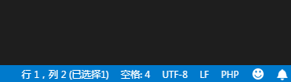
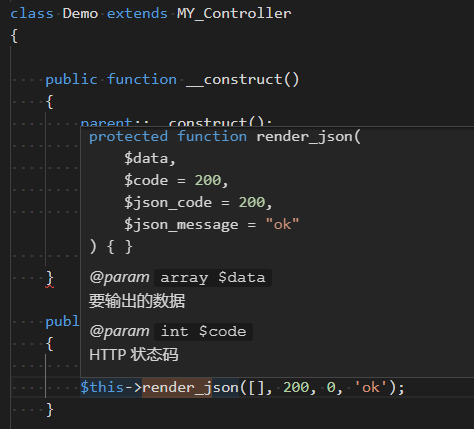

# PHP in Visual Studio Code

- 用 Notepad++ 开发 PHP 遇到什么问题
- 我们需要什么样的 PHP 开发工具
- 为什么用 Visual Studio Code
- VS Code 基本介绍
- VS Code 的 PHP 增强功能
- 参考链接

---
# 用 Notepad++ 开发 PHP 遇到什么问题

- 文档提示较弱：不能显示函数的使用说明和参数说明
- 智能补全较弱：只能对 PHP 内置函数和变量提示
- 不能自动格式化代码
- 一些错误不能自动发现

---
# 我们需要什么样的 PHP 开发工具

- 对内置函数和项目内函数有文档提示
- 对内置函数和项目内函数能自动补全
- 自动格式化代码
- 对格式错误，语法错误和部分语义错误能自动提示
- 转到定义，查找引用
- 代码块功能
- 重构功能
- 调试功能
- git 集成

---
# 为什么用 Visual Studio Code

- PhpStorm：收费
- Eclipse：慢，大
- VS Code：轻量，免费，速度快

---
# VS Code 基本介绍

- 视图
- 配置
- 快捷键
- 插件

---
# VS Code 的 PHP 插件

- PHP Intelephense：代码格式化，智能提示
- PHP IntelliSense：自动完成，查找符号，定义，引用
- PHP Debug：调试
- PHP Snippets：快速输入代码段
- PHP Symbols：本机没安装 PHP 环境时提供一些提示
- php cs：代码风格检查
- php cs fixer：代码风格修复
- Format HTML in PHP：格式化嵌入在 HTML 里的 PHP

如何安装插件，如何查看插件的配置

---
# VS Code 的 PHP 增强功能

- 缩进、回车、编码设置
- 文档提示，语法高亮，智能补全
- 代码规范检查，代码格式化
- 代码错误检查，错误修复
- git 集成
- 常用快捷键

---

# 缩进、回车、编码设置

- 缩进：统一用 4 个空格，不用 tab
- 回车：统一用 \n，不用 \r\n
- 编码：统一用 utf-8
- 把现有`跳格`转换为`空格`

配置：

- vsc：`"files.eol": "\n"`
- git：`git config --global core.autocrlf false`

---
# 文档提示

- 鼠标放在类，方法，函数上会有提示
- 右键点击类，方法，函数选择 `查看定义` 可在快速窗口查看其定义，按 `esc` 退出

render_json 是父类 MY_Controller 的方法，在子类里可以进行文档提示，智能补全。

---
# 代码格式化

- 设置默认格式化为：PHP Intelephense
- 格式化代码：Shift + Alt + F
- 关闭默认的 PHP 检查

    "php.suggest.basic": false,
    "php.validate.enable": false

如果 cpu 占用太高，可在任务管理器里杀死 php 进程

---
# 代码风格检查

- windows 环境变量 PATH 添加 d:\xampp7\php
- 安装php-cs

    cd d:\xampp7\php7
    pear install --alldeps PHP_CodeSniffer
    phpcs -i    
    phpcs --standard=myruleset.xml xxx.php
    
- 安装 vs code 插件
- 配置插件

    "php.validate.executablePath": "D:/xampp7/php/php.exe"
    "phpcs.executablePath": "D:/xampp7/php/phpcs.bat"
    "phpcs.standard": "D:/myruleset.xml"

---
# 自定义代码风格

    <?xml version="1.0"?>
    <ruleset name="techaction">
        <description>The Techaction coding standard.</description>
        <rule ref="PSR2">
            <exclude name="PSR1.Files.SideEffects.FoundWithSymbols"/>
            <exclude name="PSR1.Classes.ClassDeclaration.MissingNamespace"/>
            <exclude name="PSR1.Methods.CamelCapsMethodName.NotCamelCaps"/>
            <exclude name="PSR2.Methods.MethodDeclaration.Underscore"/>
            <exclude name="Generic.ControlStructures.InlineControlStructure.NotAllowed"/>
            <exclude name="Generic.Files.LineLength"/>
            <exclude name="Generic.ControlStructures.InlineControlStructure.Discouraged"/>
            <exclude name="Squiz.Classes.ValidClassName.NotCamelCaps"/>
        </rule>
        <rule ref="PEAR" >
            <exclude name="PEAR.NamingConventions.ValidFunctionName.ScopeNotCamelCaps"/>
            <exclude name="PEAR.Commenting.ClassComment.Missing"/>
            <exclude name="PEAR.Commenting.FunctionComment.Missing"/>
            <exclude name="PEAR.Commenting.FunctionComment.MissingReturn"/>
            <exclude name="PEAR.Commenting.FunctionComment.MissingParamTag"/>
            <exclude name="PEAR.Commenting.FileComment.Missing"/>
            <exclude name="PEAR.Commenting.FileComment.MissingTag"/>
        </rule>
    </ruleset>

---
# 排除规则

- 禁用部分代码段

    // phpcs:disable
    some php code
    // phpcs:enable

---
# 代码风格修复

- 下载 [php-cs-fixer](https://github.com/FriendsOfPHP/PHP-CS-Fixer)
- 安装 vs code 插件
- 配置：php-cs-fixer.executablePath
- 代码风格修复：F1， php-cs-fixer: fix this file

---

# 代码片段及补全

- 快捷键改动：
	- 首选项/键盘快捷方式/触发建议 改为 `alt + /`
- 编写函数：输入 `p.fun` 按 `alt + /` 后选择 `p.function` 回车，按 `tab` 进行改动
- 编写类：输入 `class`, `p.class`, `docclass` 后回车
- 继承类：在 `extends` 后输入 `MY` 按 `alt + /` 后选择 `MY_Controller` 回车
- 构造函数：在类里输入 `__` 按 `alt + /` 后选择 `p.__construct` 回车，函数参数尽量使用类型声明
- 编写方法：在类里输入 `fun` 或 `p.docmethod` 回车

---

# 代码片段及补全

- 声明数组：输入 `array` 选择 `小方块 array` 回车
- 语句块：输入 `if` `if?` `ifelse` `switch` `for` `foreach` `do` `while` `try` 选择 `小方块` 回车
- 方法注释：在方法名上面输入 `/**` 回车
- 参数注释：输入 `p.docp` 选择 `p.docparam` 回车
- 函数调用补全：输入 `json_` 提示 `json_decode` 后回车
- 类成员调用补全：输入 `$this->` 后按 `alt + /` 会提示本类及父类的属性和方法，选中后回车。

---
# 代码跳转

- 跳到定义：按住 `ctrl` 点击类，方法或属性
- 跳回上一次光标：按住 `alt + 左右方向` 

---
# 代码搜索

- 查找引用：右键点击类或方法，选择`Find All References` 或 `查找引用`

---
# 重构： TODO

- rename
- 提取方法

---

# 语法检查

- 未使用变量提示

---
# 调试

---
# git 集成

- 查看改动文件列表
- 查看改动内容
- 添加到索引
- 提交到本地
- 推送到远程仓库

---

# 参考链接

- [Visual Studio Code: How to show line endings](https://stackoverflow.com/questions/39525417/visual-studio-code-how-to-show-line-endings)
- [How to setup PHP CodeSniffer on Windows machine ?](http://subharanjan.com/setup-php-codesniffer-windows-machine/)
- [vscode 中使用php-cs-fixer和PHP Formatter 插件规范化PHP代码](https://www.cnblogs.com/huangtailang/p/6604124.html)
- [vscode：visual studio code 调试php](https://blog.csdn.net/x356982611/article/details/52664334)
- [vscode-phpcs](https://github.com/ikappas/vscode-phpcs/tree/master/phpcs)
- [PEAR Coding Standards](https://pear.php.net/manual/en/coding-standards.php)

---

# 参考链接

- [How to setup PHP CodeSniffer that extend WordPress coding standards + autofix errors in VSCode?](https://stackoverflow.com/questions/53635328/how-to-setup-php-codesniffer-that-extend-wordpress-coding-standards-autofix-er/53653193#53653193)
- [规则生成器](http://edorian.github.io/php-coding-standard-generator/#phpcs)
- [Selectively disable rules with codingStandardsIgnoreStart and codingStandardsIgnoreLine](https://github.com/squizlabs/PHP_CodeSniffer/issues/604)
- [Creating Your Own Standard in PHPCS](http://www.thisprogrammingthing.com/2015/creating-your-own-standard-in-phpcs/)
- [CodeSniffer case indentation issue](https://stackoverflow.com/questions/15243866/codesniffer-case-indentation-issue)

---
# 参考链接

- [Conditional breaks in case statements get incorrect indentions](https://github.com/squizlabs/PHP_CodeSniffer/issues/307)
- [What's the dominant naming convention for variables in PHP: camelcase or underscores?](
https://softwareengineering.stackexchange.com/questions/196416/whats-the-dominant-naming-convention-for-variables-in-php-camelcase-or-undersc)
- [How to ignore some errors or warnings in PHP_CodeSniffer](https://stackoverflow.com/questions/51473714/how-to-ignore-some-errors-or-warnings-in-php-codesniffer)
- [PHP Coding Standards Fixer](https://cs.symfony.com/)

