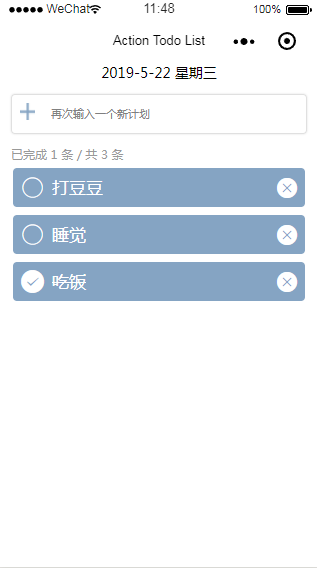

# 官方零基础入门教程

- [小程序开发指南](https://developers.weixin.qq.com/ebook?action=get_post_info&docid=0008aeea9a8978ab0086a685851c0a)

---

# 小程序优势

- 快速的加载
- 更强大的能力
- 原生的体验
- 易用且安全的微信数据开放
- 高效和简单的开发

---

# 起步

- 申请账号
	- 需要邮箱
	- 获取到 appid
	- 如果只体验不发布，可用试用帐号
- 安装开发工具
	- 文件树、代码区、预览区、调试区
	- 扫描预览默认的 QuickStart 项目

---

# 代码构成

- JSON 配置
	- app.json，project.config.json，page.json
- WXML 界面
	- 新标签：page，view, block, text
	- 数据绑定语法 {{}}，自定义属性 wx:if, wx:for 
	- 自定义组件
- WXSS 样式
	- iphonx 6 上 1rpx = 0.5px = 1物理像素
	- app.wxss，page.wxss
- JS 逻辑	
	- es6
	- Page({data: {}, onLoad(){}})
	- wx.xxx API

---
# 开发流程

- 整体的产品体验有一个清晰的规划和定义
- 交互图或者手稿描绘小程序的界面交互
- 完成WXML+WXSS还原设计稿
- 梳理出 data 部分，填充 WXML 的模板语法
- 完成JS逻辑部分

---
# Flex布局

- 传统网页开发： 盒模型，通过 display、 position、float来实现布局，缺乏灵活性且有些适配效果难以实现。
- flex 布局：提供一种更灵活的布局模型，方便适配不同大小的内容区域。
- .container: 
	- flex-direction，flex-wrap，justify-content，align-items，align-content 
- .item：
	- order，flex-shrink，flex-grow，flex-basis，flex，align-self 
- [教程](https://developers.weixin.qq.com/ebook?action=get_post_info&docid=00080e799303986b0086e605f5680a)

---
# Todo List Demo



https://www.cnblogs.com/flyingjun/p/9739394.html

---
# Demo：页面布局

wxml

```
<view class = "container">
</view>
```
wxss
```
.container {
  display: flex;
  flex-direction: column;
  align-items: center;
}
```

---
# Demo：日期

wxml
```
<view class="today">
    <text>{{Today}}</text>
</view>
```
wxss
```
.today {
    font-size: 14px;
}
```

---
# Demo：输入框 wxml

```
<view class="add-container">
  <view class="add-inner">
    <image class='plus' src='../../images/plus.png' />
    <input value="{{input}}" 
      auto-focus 
      class="input-add" 
      placeholder='再次输入一个新计划' 
      bindinput='addInput' 
      bindconfirm='addConfirm'  />
  </view>
</view>
```

---

# Demo：输入框 wcss

```
.add-container {
  width: 100%;
}

.add-inner {
  display: flex;
  flex-direction: row;
  align-items: center;
  border: 1rpx solid #e0e0e0;
  border-radius: 10rpx;
  box-shadow: 0 0 5rpx #e0e0e0;
  margin: 30rpx;
  padding: 20rpx;
}

.plus {
  width: 40rpx;  height: 40rpx; 
}

.input-add {
  padding-left: 20rpx;  font-size: 28rpx;  flex-grow: 1;;
}
```

---
# Demo: 状态条

wxml

```
<view class='status-info'>
  <text>已完成 {{completedCount}} 条  / 
    共 {{TodayList.length}} 条</text>
</view>
```

wxss

```
.status-info {
  text-align: left;
  font-size: 12px;
  color: #999;
  /* 必须设置，因为父容器设置 align-items后，子容器会自动收缩 */
  width: 100%;
}

.status-info text {
  margin-left: 30rpx;
}
```

---

# Demo：Todo 列表 wxml

```
<view class="todo-container">
  <view class="todo-inner">
    <view class="todo-item" 
      wx:for="{{TodayList}}" wx:key="{{index}}"
      bindtap="toggleTodo" id="{{index}}">
      
      <icon type="{{item.completed ? 'success': 'circle'}}" 
        color="white" />
        
      <text class="{{item.completed ? 'completed': ''}}">
        {{item.description}}
      </text>
      
      <icon type='clear' id='{{index}}'
        color="white" catchtap="removeTodo" />
        
    </view>
  </view>
</view>
```

---

# Demo：Todo 列表 wcss

```
.todo-container { width: 100%; }

.todo-inner { padding: 0 20rpx; }

.todo-item {
  display: flex;
  padding: 20rpx;
  margin: 10px 0;
  background-color: #85a4c3;
  border-radius: 10rpx;
}

.todo-item text {
  /* 占满剩余左右图标剩余的全部 */
  flex: 1;
  font-size: 40rpx; color: white; margin-left: 20rpx;
}

.todo-item .completed { text-decoration: line-through; }

```

---
# Demo：业务逻辑，主框架

```
Page({
  data: {
    TodayList: [],
    Today: "",
    input: ""
  },

  onLoad: function() {
    var d = new Date();
    this.setData({
      Today: d.getFullYear() 
        + '-' + (d.getMonth() + 1) 
        + '-' + d.getDate() 
    });

    this.loadData();
  },
})

```

---
# Demo：业务逻辑，加载和保存数据

```
save: function() {
    wx.setStorageSync('TodayList', this.data.TodayList);
    this.loadData();
},

loadData: function() {
    var todo = wx.getStorageSync('TodayList');
    if (todo) {
        this.setData({
            TodayList: todo,
            completedCount: todo.filter(function(x){
                return x.completed
            }).length,
        });
    }
},
```

---
# Demo：业务逻辑，添加任务

```
// 实时获取用户输入文字
addInput: function (e) {
    this.setData({ input: e.detail.value });
},

// 回车后添加任务
addTodo: function(e) {
    // 在最前面添加一条数据
    this.data.TodayList.unshift({
        description: this.data.input,
        completed: false
    });

    // 保存并刷新
    this.save();
    // 清空输入框
    this.setData({ input: ''  });
},
```

---
# Demo：业务逻辑，改变任务状态

```
//改变任务状态
toggleTodo: function(e) {
  var index = e.currentTarget.id;
  var todo = this.data.TodayList;
  todo[index].completed = !todo[index].completed;
  this.save();
},

```

---

# Demo：业务逻辑，删除任务

```
//删除任务
removeTodo: function(e) {
  var index = e.currentTarget.id;
  this.data.TodayList.splice(index, 1);
  this.save();
},
```

---
# 使用 WeUI 视觉规范

相当于 Bootstrap

1. 拷贝 weui.wxss 到根目录
2. wxss 中引入样式

```
@import '../../weui.wxss';
```
3. wxml 中使用样式
```
<button class="weui-btn" type="primary">主操作</button>
<button class="weui-btn" type="default">次要操作</button>
```

---
# 使用第三方组件，如 iview

1. 新建 iview 子目录，把要用的组件如 button 拷贝进去
2. 在 page.json 中引用组件

```
{
  "usingComponents": {
    "i-button": "../../iview/button/index"
  }
}
```
3. 在 wxml 中使用组件

```
<i-button type="primary" bind:click="handleClick">
  这是一个按钮</i-button>
```