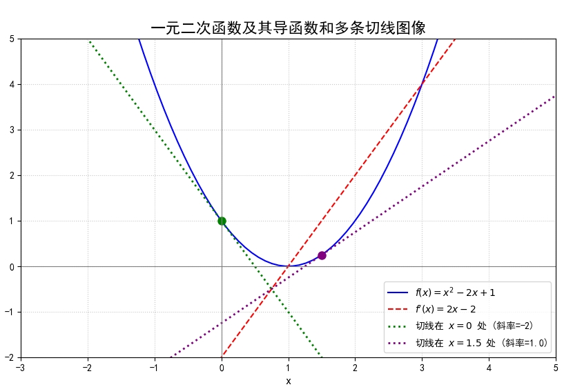

# 零基础学神经网络

蛙蛙

2025-06

  开始 <carbon:arrow-right />

---

# 目录

带着问题学习

- 什么是函数？什么是函数的导数？导数的作用是什么？
- 为什么要学习神经网络？神经网络可以拟合任何函数吗？
- 为什么神经元有权重，还有偏置？如何正确初始化权重和偏置？
- 为什么需要激活函数？有哪些激活函数，如何选择？如何求激活函数的导数？
- 为什么需要损失函数？有哪些损失函数，如何选择？
- 什么是前向传播和反向传播？它们的数学意义是什么，如何用代码实现它们？
- 什么是梯度丢失？如何防止梯度丢失？
- 如何设置学习率？如何设置迭代次数？如何设置神经元数量？
- 误差，权重，梯度之间的关系是什么？为什么误差要乘以激活函数的导数？
- 什么时候应该增加网络的层数？什么时候应该网络层中的神经元数量？
- 什么是欠拟合和过拟合？分别如何解决？
- 如何用神经网络解决 AND, XOR 逻辑门，一元二次函数，正弦函数，鸢尾花分类问题？

---

# 什么是函数？什么是函数的导数？导数的作用是什么？

- 什么是函数？
  - 函数就像一个“机器”或“黑箱”，你给它一个输入值，它就会根据一定的规则产生一个唯一的输出值。
  - $f(x) = x^2$：这是一个函数，当你输入 $x=2$ 时，输出 $f(2) = 2^2 = 4$。
- 什么是函数的导数？
  - 它描述了函数在某一点瞬时变化率。
  - 如果将函数 $y = f(x)$ 的图像看作一条曲线，那么函数在某一点的导数就等于该曲线在这一点处的**切线斜率**。
- 导数的作用是什么？
  - **描述变化趋势：** 导数的正负可以判断函数是增加还是减少。如果导数大于0，函数是增函数；如果导数小于0，函数是减函数。
  - **描述变化速度：** 在物理学中，位移对时间的导数是瞬时速度，速度对时间的导数是瞬时加速度。

---

# 一元二次函数及其导数

1.py 

 

