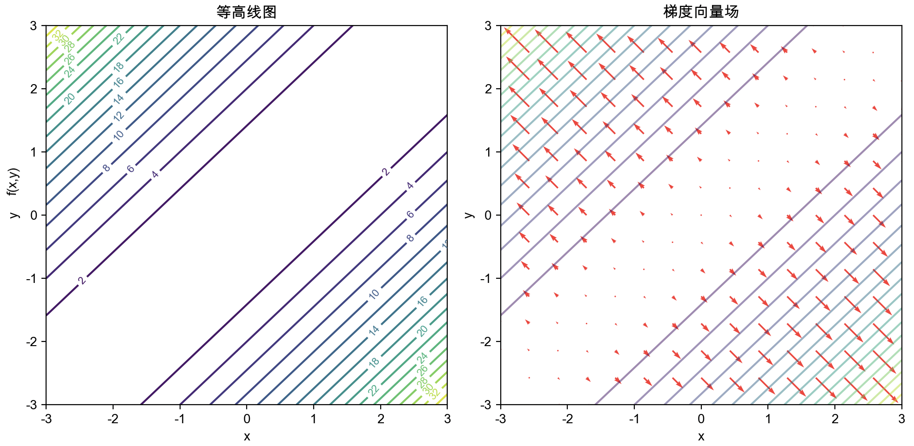
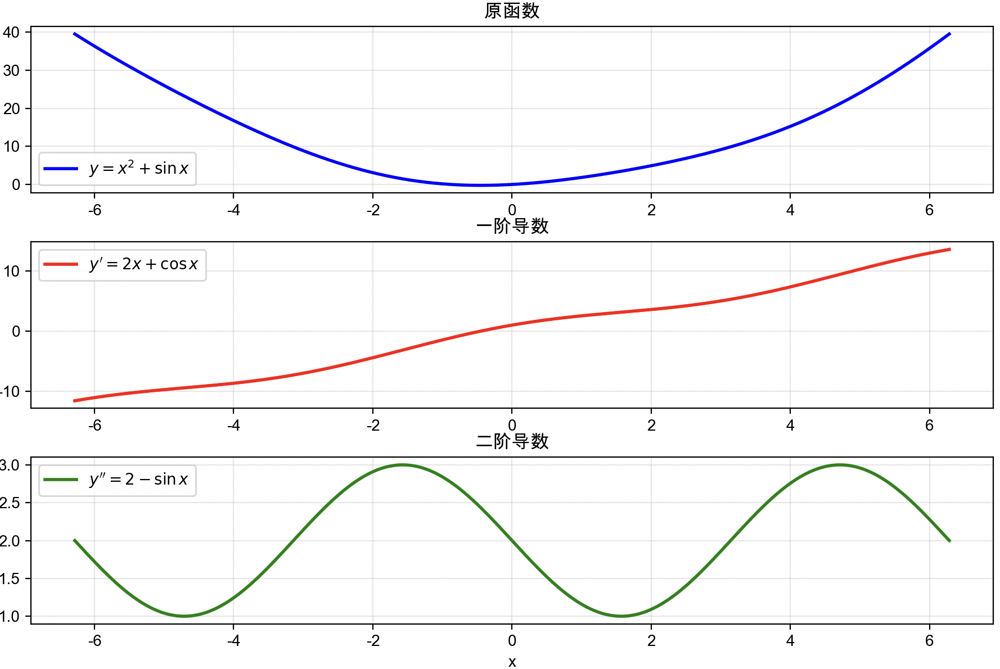
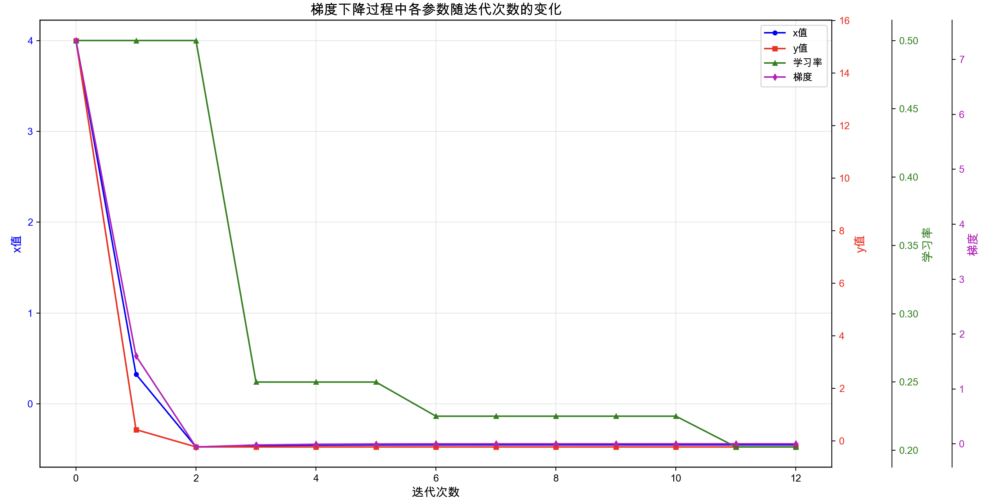

# 零基础学神经网络

蛙蛙

2025-06

<div @click="$slidev.nav.next" class="mt-12 py-1" hover:bg="white op-10">
  开始 <carbon:arrow-right />
</div>

---

# 神经网络 Hello World：手写数字识别

 

---

# 了解相关的库

- numpy
- matplotlib
- sklearn

---

# 手写数字识别 

digit_recognition.py

```python
# 1. 加载数据
digits = load_digits()
X, y = digits.data, digits.target

# 2. 分割数据
X_train, X_test, y_train, y_test = train_test_split(X, y, test_size=0.2, random_state=42)

# 3. 创建神经网络
mlp = MLPClassifier(hidden_layer_sizes=(50,), max_iter=500, random_state=42)

# 4. 训练模型
mlp.fit(X_train, y_train)

# 预测
y_pred = mlp.predict(X_test)
```
 
---

# 目录

带着问题学习

- 什么是函数？什么是函数的导数？导数的作用是什么？
- 为什么要学习神经网络？神经网络可以拟合任何函数吗？
- 为什么神经元有权重，还有偏置？如何正确初始化权重和偏置？
- 为什么需要激活函数？有哪些激活函数，如何选择？如何求激活函数的导数？
- 为什么需要损失函数？有哪些损失函数，如何选择？
- 什么是前向传播和反向传播？它们的数学意义是什么，如何用代码实现它们？
- 什么是梯度丢失？如何防止梯度丢失？
- 如何设置学习率？如何设置迭代次数？如何设置神经元数量？
- 误差，权重，梯度之间的关系是什么？为什么误差要乘以激活函数的导数？
- 什么时候应该增加网络的层数？什么时候应该网络层中的神经元数量？
- 什么是欠拟合和过拟合？分别如何解决？
- 如何用神经网络解决 AND, XOR 逻辑门，一元二次函数，正弦函数，鸢尾花分类问题？

---

# 什么是函数？

函数就像一个“机器”或“黑箱”，你给它一个输入值，它就会根据一定的规则产生一个唯一的输出值。

$f(x) = x^2$：这是一个函数，当你输入 $x=2$ 时，输出 $f(2) = 2^2 = 4$。

 


---
layout: two-columns
---

# 函数的导数

::left::

如果将函数 $y = f(x)$ 的图像看作一条曲线，那么函数在某一点的导数就等于该曲线在这一点处的**切线斜率**。

 


::right::


- 描述变化方向，x 增加 y 是增加还是减少，曲线向上还是向下，
- 描述变化速度，x 变化一个微小值，y 变化有多大，曲线是陡峭还是平缓
- 导函数和某个点的导数的区别

---
layout: two-columns
---

# 多元函数

多元函数 f(x,y) = x^2 + y^2 - 2*x*y

::left::

 

::right::

- 输入参数有多个，或者参数是一个向量
- 输出可以是一个向量，也可以是用一个标量值
- 图像是 3D 的，或者更高维度

---


# 多元函数的导数 `f(x,y) = x² + y² - 2xy`

 


- 偏导数：多元函数在某一个变量方向上的导数
- 梯度：表示一个多元函数在各个方向上的偏导数，是一个向量，∇f = (2x-2y, 2y-2x)
- 在点(1, 2)处: 函数值: f(1, 2) = 1 梯度: ∇f = (-2, 2) 梯度模长: |∇f| = 2.828
- 等高线密集表示陡峭，等高线稀疏表示平缓
---
layout: three-columns
---

# 导数的作用 1：判断凹凸性

凸性或凹性描述的是函数的形状，而极值点是否存在，则取决于函数在形状变化过程中，导数是否能为零。

::left::
$f''(x) \ge 0$， $f(x)$ 是**凸函数**， 曲线开口向上，就像一个碗。

 

- $f(x) = x^2$
- $f'(x) = \frac{d}{dx}(x^2) = 2x$
- $f''(x) = \frac{d}{dx}(2x) = 2$

::middle::

$f''(x) \le 0$， $f(x)$ 是**凹函数**，曲线开口向下，就像一个倒扣的碗。

 

- $f(x) = \ln(x)$ ($x > 0$)
-  $f'(x) = \frac{1}{x}$
- $f''(x) = -\frac{1}{x^2}$

::right::

$f''(x)$ 既有大于 0 的部分，又有小于 0 的部分，**非凸非凹函数**， 曲线有凹有凸，存在拐点。

 

- $f(x) = x^3$
- $f'(x) = \frac{d}{dx}(x^3) = 3x^2$
- $f''(x) = \frac{d}{dx}(3x^2) = 6x$

---
layout: two-columns
---

# 导数的作用 2： 求极值

::left::

原函数：$f(x) = x^4 - 4x^3 - 2x^2 + 12x + 5$

 

::right::


1. 求一阶导数：$f'(x) = 4x^3 - 12x^2 - 4x + 12$
2. 令一阶导数等于零：$4x^3 - 12x^2 - 4x + 12 = 0$
3. 求临界点：`np.roots([4, -12, -4, 12])` 得 $x = -1, 1, 3$
4. 求二阶导数：$f''(x) = 12x^2 - 24x - 4$
5. 把临界点带入二阶导数，大于 0 是局部最小值，小于 0 是局部最大值
---
layout: two-columns
---

# 导数的作用 3： 线性近似 $\sqrt{4.01}$

在一个函数曲线上的某一点附近，这条曲线的形状与它在该点的切线形状非常相似。因此，我们可以用切线（一条简单的直线）来近似该点附近复杂的曲线。

::left::

计算 $f(x_0)$ 和 $f'(x_0)$

- $f(x) = x^{1/2}$
- $f(x_0) = f(4) = \sqrt{4} = 2$
- $f'(x) = \frac{d}{dx}(x^{1/2}) = \frac{1}{2}x^{(1/2 - 1)} = \frac{1}{2}x^{-1/2} = \frac{1}{2\sqrt{x}}$
- $f'(x_0) = f'(4) = \frac{1}{2\sqrt{4}} = \frac{1}{2 \cdot 2} = \frac{1}{4} = 0.25$

它提供了一种快速、相对准确的方式来估算函数在某点附近的值。

::right::
应用线性近似公式

- $f(x) \approx f(x_0) + f'(x_0)(x - x_0)$
- $\sqrt{4.01} \approx f(4) + f'(4)(4.01 - 4)$
- $\sqrt{4.01} \approx 2 + 0.25(0.01)$
- $\sqrt{4.01} \approx 2 + 0.0025$
- $\sqrt{4.01} \approx 2.0025$

---
layout: two-columns
---

# 求最小值 $y = x² + sinx$

假设函数图像是处处连续，平滑，可导的

::left::

 

::right::

**证明有最小值**

- 图像不是严格证明
- 二阶导数曲线恒大于 0 ，说明是凸函数，至少可能有最小值
  - sinx 的值在 -1 到 1 之间，$2-sin(x)$ 肯定大于 0 
- 一阶导数曲线穿越 0 轴，说明可取 0 值，即肯定有最小值

**求最小值**：令一阶导数等于 0，$2x + \cos x = 0$，得 $-0.5 \le x \le 0.5$
---
layout: two-columns
---

# 梯度下降法求最小值(一元函数)

不需要知道目标函数及其导数的解析式，只能调用目标函数，如何求极值？

::left::

 

- 如何处理多个极值点？
- 如何防止步长太大跳过极值点？

::right::

1. 随机选取一个点（在定义域内）
2. 用数值差分法求该点的近似导数（梯度）
3. 根据梯度的方向选择下一个点的方向
4. 确定步长系数（学习率），梯度变号后减半，防止连续震荡
5. 迭代 2-4 步，直到步长几乎不再缩小

---
layout: two-columns
---

# 梯度下降，代码

`digit_recognition.py`

::left::

- 定义目标函数: $y = x² + sinx$
- 计算函数在某点的导数（梯度）
- 定义相关变量
```python
def target_function(x):
    return x**2 + np.sin(x)

def calculate_gradient(x, h=1e-6):
    # 用数值差分法近似导数：f'(x) ≈ [f(x+h) - f(x)] / h
    return (target_function(x + h) - target_function(x)) / h

x = np.random.uniform(-5, 5) # 随机初始化一个点
learning_rate=0.1            # 初始化一个步长，学习率
min_step=1e-6                # 找到极值最小步长
max_iterations=1000          # 最大迭代次数
```
::right::

迭代过程

```python
for iteration in range(max_iterations):
    # 计算当前点的梯度
    # 动态调整学习率
    # 梯度下降更新位置
    # 检查是否收敛（步长足够小）
```

---

# 梯度下降，代码

迭代过程

```python
last_gradient = calculate_gradient(x)
for iteration in range(max_iterations):        
    gradient = calculate_gradient(x)     # 计算当前点的梯度
            
    if iteration > 0:                    # 检查梯度方向是否变化，动态调整学习率        
        if gradient * last_gradient < 0: 
            print(f"学习率变化：gradient={gradient:.4f}, last_gradient={last_gradient:.4f}",
                    f"learning_rate={learning_rate}")
            learning_rate *= 0.5
            
    new_x = x - learning_rate * gradient # 梯度下降更新位置
    if abs(new_x - x) < min_step:        # 检查是否收敛（步长足够小）
        break
        
    x = new_x
    last_gradient = gradient
    print(f"Iteration {iteration}: x = {x:.4f}, y = {target_function(x):.4f}, "
            f"gradient = {gradient:.4f}, learning_rate = {learning_rate:.4f}")
    
print(f"找到极值点: x = {x:.6f}, y = {target_function(x):.6f}, gradient = {gradient:.6f}")
```
---

# 梯度下降，可视化

 

---

# 梯度下降，初始化一个较大的学习率

初始 x 为 4， 学习率为 0.5

- 梯度下降很快，迭代 9 次即可找到最优点
- 迭代到第 2 次时，梯度由正转负，学习率从 0.5 下降到 0.25

```
随机初始点: x = 4.0000, y = 15.2432
Iteration 0: x = 0.3268, y = 0.4278, gradient = 7.3464, learning_rate = 0.5000
Iteration 1: x = -0.4735, y = -0.2318, gradient = 1.6007, learning_rate = 0.5000
学习率变化：gradient=-0.0571, last_gradient=1.6007 learning_rate=0.5
Iteration 2: x = -0.4593, y = -0.2324, gradient = -0.0571, learning_rate = 0.2500
Iteration 3: x = -0.4537, y = -0.2325, gradient = -0.0221, learning_rate = 0.2500
Iteration 4: x = -0.4516, y = -0.2325, gradient = -0.0086, learning_rate = 0.2500
Iteration 5: x = -0.4507, y = -0.2325, gradient = -0.0034, learning_rate = 0.2500
Iteration 6: x = -0.4504, y = -0.2325, gradient = -0.0013, learning_rate = 0.2500
Iteration 7: x = -0.4503, y = -0.2325, gradient = -0.0005, learning_rate = 0.2500
Iteration 8: x = -0.4502, y = -0.2325, gradient = -0.0002, learning_rate = 0.2500
Iteration 9: x = -0.4502, y = -0.2325, gradient = -0.0001, learning_rate = 0.2500
找到极值点: x = -0.450197, y = -0.232466, gradient = -0.000031
```

---

# 梯度下降，初始化一个较小的学习率

初始 x 为 4， 学习率为 0.1

- 梯度下降很慢，迭代 45 次才找到最优点
- 梯度符号始终为正，没有变号，学习率始终没有下降

```
随机初始点: x = 4.0000, y = 15.2432
Iteration 0: x = 3.2654, y = 10.5391, gradient = 7.3464, learning_rate = 0.1000
Iteration 1: x = 2.7115, y = 7.7693, gradient = 5.5384, learning_rate = 0.1000
Iteration 2: x = 2.2601, y = 5.8798, gradient = 4.5141, learning_rate = 0.1000
Iteration 3: x = 1.8717, y = 4.4583, gradient = 3.8842, learning_rate = 0.1000
Iteration 4: x = 1.5270, y = 3.3307, gradient = 3.4470, learning_rate = 0.1000
Iteration 5: x = 1.2172, y = 2.4197, gradient = 3.0978, learning_rate = 0.1000
Iteration 6: x = 0.9391, y = 1.6890, gradient = 2.7807, learning_rate = 0.1000
...
Iteration 43: x = -0.4501, y = -0.2325, gradient = 0.0002, learning_rate = 0.1000
Iteration 44: x = -0.4501, y = -0.2325, gradient = 0.0002, learning_rate = 0.1000
Iteration 45: x = -0.4501, y = -0.2325, gradient = 0.0001, learning_rate = 0.1000
找到极值点: x = -0.450145, y = -0.232466, gradient = 0.000096
```


---

# 小结，思考一下

- x 变化的方向？梯度指向函数增长最快的方向，我们找最小值，所以要向相反方向移动
- 移动步长为什么要考虑学习率? `new_x = x - learning_rate * gradient`
  - 防止步长过大：如果直接用梯度更新 `new_x = x - gradient`，可能一步跳过最优点
  - 控制收敛速度：合适的学习率让算法既不会收敛太慢，也不会震荡不收敛
- 学习率变化必须考虑梯度大小吗？不能固定吗？
  - 是的，绝对需要
  - 梯度大：函数变化陡峭，需要小学习率防止跳过最优点
  - 梯度小：函数变化平缓，可以用大学习率加速收敛
- 学习率可以大于1吗？
  - 学习率 > 1 意味着每次更新的步长比梯度本身还大
  - 在梯度较大的陡峭区域，容易导致震荡或发散

---

# 小结，思考一下

超参数学习率取值范围如何确定？

- 经验法则：
  - 通常在 [0.001, 1.0] 范围内
  - 深度学习常用：0.01, 0.001, 0.0001
  - 传统优化常用：0.1, 0.01
- 确定方法：
  - 网格搜索：尝试 [0.1, 0.01, 0.001] 等
  - 学习率调度：从大到小逐步尝试
  - 观察损失曲线：震荡说明太大，下降太慢说明太小
- 自适应方法：AdaGrad，Adam，RMSprop


---

# 小结，思考一下

什么时候停止迭代？`abs(new_x - x) < min_step`

- 当 x 移动步长很小，绝对值接近 0 的时候，说明几乎无法移动 x 来降低函数值 y
- x 的变化大小取决于梯度和学习率 `new_x = x - learning_rate * gradient`
- 学习率只有梯度变号时才会缩小，所以不是主要因素
- 梯度每次都会变化，所以是主要因素
- 最终就是梯度比较小，就是坡度比较平缓的时候，实际上就是导数接近 0 的时候


---
layout: two-columns
---

# 回归，根据数据点拟合函数

- 之前的梯度下降算法有一个可调用的目标函数
- 现在没有目标函数，只有一些数据点，但它看起来像一个二次函数曲线
- 我们想用 $f(x) = ax^2 - bx + c$ 来拟合这些点，寻找最优的 a, b, c，这就叫回归

::left::  

 

::right::

- 没有导数，只有数据点
- 定义误差函数（损失函数，代价函数）
- 验证误差函数的平滑线，凹凸性，是否有极值
  - 绝对值函数不平滑
  - 误差平方函数，光滑可导，凸函数，有极值
- 用梯度下降法求误差函数的最小值

---

# 梯度下降（多元函数）

数学原理

**1. 问题建模：**

用函数：$f(x) = ax^2 - bx + c$ 去拟合一组平面上的点：$(x_1, y_1),\ (x_2, y_2),\ \ldots,\ (x_n, y_n)$

**2. 误差函数设计：**（也叫损失函数，代价函数）

平方误差和（Mean Squared Error），平滑可导，凸函数，有极值（绝对值误差和则不可以）。

设 $\hat{y}_i=ax_i^2 - bx_i + c, e_i=\hat{y}_i - y_i$，则$L(a, b, c) = \frac{1}{n} \sum_{i=1}^{n}e_i^2 =\frac{1}{n} \sum_{i=1}^{n} \left[ ax_i^2 - bx_i + c - y_i \right]^2$

**3. 分别对 $a$，$b$，$c$ 求偏导数**

$\frac{\partial L}{\partial a}=\frac{\partial}{\partial a} \left( \frac{1}{n} \sum_{i=1}^n e_i^2 \right)=\frac{1}{n} \sum_{i=1}^n\frac{\partial}{\partial a} \left(e_i^2\right)= \frac{1}{n} \sum_{i=1}^n 2 e_i \cdot \frac{\partial e_i}{\partial a}$

$e_i = ax_i^2 - bx_i + c - y_i \Rightarrow \frac{\partial e_i}{\partial a} = x_i^2$，所以$\frac{\partial L}{\partial a} = \frac{2}{n} \sum_{i=1}^n e_i x_i^2
= \frac{2}{n} \sum_{i=1}^n (ax_i^2 - bx_i + c - y_i) x_i^2$

同理：$\frac{\partial L}{\partial b} = \frac{-2}{n} \sum_{i=1}^{n} \left( ax_i^2 - bx_i + c - y_i \right)x_i$，$\frac{\partial L}{\partial c} = \frac{2}{n} \sum_{i=1}^{n} \left( ax_i^2 - bx_i + c - y_i \right)$

**求导提示**：1. 链式求导法则 2. 导数运算是线性的，常数因子可提取 3. 和运算求导可先分别求导，再求和


---

# 问题建模 

**4、梯度下降法（Gradient Descent）**

使用以下更新规则迭代优化：

$$
a \gets a - \eta \cdot \frac{\partial L}{\partial a}
$$

$$
b \gets b - \eta \cdot \frac{\partial L}{\partial b}
$$

$$
c \gets c - \eta \cdot \frac{\partial L}{\partial c}
$$

其中 $\eta$ 是学习率。
