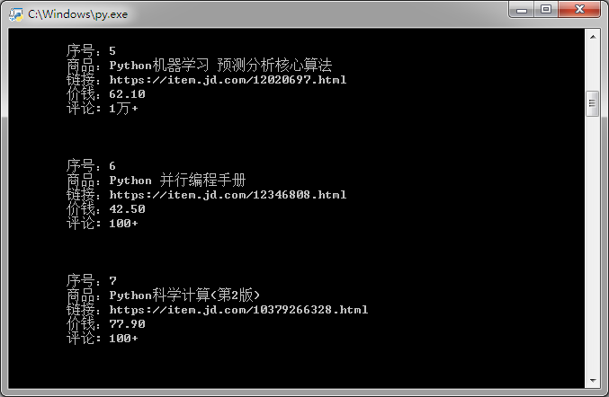

# 安装 selenium

	pip3 install selenium
 
---

# 安装 chromedriver

- 因为官方网址被墙，需要到国内镜像下载
	- http://npm.taobao.org/mirrors/chromedriver/
- 版本要对应
	- v2.40 对应 Chrome v66-68
- 版本对应信息如下
	- http://npm.taobao.org/mirrors/chromedriver/2.40/notes.txt
- 把 `chromedriver.exe` 保存在 `Chrome` 安装目录
	- 一般是 `C:\Program Files (x86)\Google\Chrome\Application` 目录

---

# 运行 DEMO

双击 `seleniumtest.py` 即可

